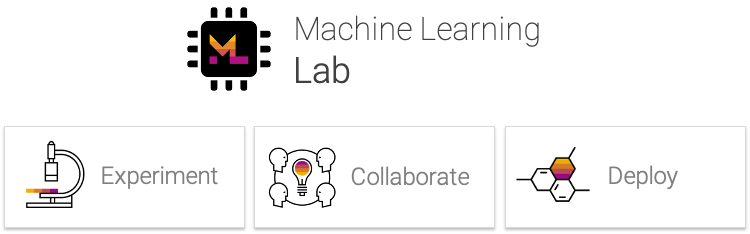

<h1 align="center">
    <a href="https://github.com/sap/machine-learning-lab" title="ML Lab Home">
     </a>
</h1>

<p align="center">
    <strong>End-to-end collaborative development platform to build and run machine learning solutions.</strong>
</p>

<p align="center">
    <a href="https://hub.docker.com/r/mltooling/ml-lab" title="Docker Image Version"></a>
    <a href="https://hub.docker.com/r/mltooling/ml-lab" title="Docker Image Metadata"></a>
    <a href="https://hub.docker.com/r/mltooling/ml-lab" title="Docker Pulls"></a>
    <a href="https://github.com/sap/machine-learning-lab/commits/" title="Last Commit"></a>
    <a href="https://github.com/sap/machine-learning-lab/blob/master/LICENSE" title="ML Lab License"></a>
    <a href="https://api.reuse.software/info/github.com/sap/machine-learning-lab" title="REUSE status"></a>
</p>

<p align="center">
  <a href="#getting-started">Getting Started</a> •
  <a href="#todo">Documentation</a> •
  <a href="#support--feedback">Support</a> •
  <a href="https://github.com/sap/machin-learning-lab/issues/new?labels=bug&template=01_bug-report.md">Report a Bug</a> •
  <a href="https://sap.github.io/machine-learning-lab/faq/">FAQ</a> •
  <a href="#contributing">Contributing</a> •
  <a href="https://github.com/sap/machin-learning-lab/releases">Changelog</a>
</p>

ML Lab is a centralized hub for development teams to seamlessly build, deploy, and operate machine learning solutions at scale. It is designed to cover the end-to-end machine learning lifecycle from data processing and experimentation to model training and deployment. It combines the libraries, languages, and tools data scientists love, with the infrastructure, services and workflows they need to deliver machine learning solutions into production.

## Highlights

- 🔐 Secure multi-user development plaform for machine learning solutions.
- 🛠 Workspace with integrated tooling (Jupyter, VS Code, SSH, VNC, Hardware Monitoring, ...)
- 🗃️ Upload, manage, version, and share datasets & models.
- 🔬 Monitor and share experiments for reproducability.
- 🎛 Deploy and operate machine learning solutions for productive usage.
- 🐳 Deployable on a single-server via Docker or a server-cluster via Kubernetes.

## Getting Started

Deploying ML Lab in a single-host deployment (via Docker) is as simple as:

```bash
docker run --rm \
           --env LAB_ACTION=install \
           --env LAB_PORT=8080 \
           --env BACKEND_SERVICE_IMAGE=docker.pkg.github.com/sap/machine-learning-lab/lab-service:0.1.0 \
           --env MODEL_SERVICE_IMAGE=docker.pkg.github.com/sap/machine-learning-lab/lab-model-service:0.1.0 \
           --env WORKSPACE_IMAGE=docker.pkg.github.com/sap/machine-learning-lab/ml-workspace-lab:0.1.0 \
           -v /var/run/docker.sock:/var/run/docker.sock \
           docker.pkg.github.com/sap/machine-learning-lab/lab-service:0.1.0
```

Voilà, that was easy! Now, Docker will pull the required Docker images to your machine. We deployed the current version to the GitHub package repository which requires the image environment variables to be set; that might change in the future.
After the installation is finished, visit http://<HOSTIP>:8080 and login with `admin:admin` (please change the admin password from the user menu).

Please refer to [our documentatation](https://sap.github.io/machine-learning-lab/installation/install-lab/) for further information on deploying ML Lab for productive usage, including information about configuration options, Kubernetes deployment, adminisrative task and general usage.

## Known Issues

For known issues and other questions, check out the [documentation](https://sap.github.io/machine-learning-lab/faq/).

## Support & Feedback

The ML Lab project is maintained by [Benjamin Räthlein](https://twitter.com/raethlein) and [Lukas Masuch](https://twitter.com/LukasMasuch). Please understand that we won't be able to provide individual support via email. We also believe that help is much more valuable if it's shared publicly so that more people can benefit from it.

| Type                     | Channel                                              |
| ------------------------ | ------------------------------------------------------ |
| 🚨 **Bug Reports**       | <a href="https://github.com/sap/machine-learning-lab/issues?utf8=%E2%9C%93&q=is%3Aopen+is%3Aissue+label%3Abug+sort%3Areactions-%2B1-desc+" title="Open Bug Report"></a>                                 |
| 🎁 **Feature Requests**  | <a href="https://github.com/sap/machine-learning-lab/issues?q=is%3Aopen+is%3Aissue+label%3Afeature-request+sort%3Areactions-%2B1-desc" title="Open Feature Request"></a>                                 |
| 👩‍💻 **Usage Questions**   |  _tbd_ |
| 🗯 **General Discussion** | _tbd_ 

<br>

## Documentation

Please refer to [our documentatation](https://sap.github.io/machine-learning-lab/) for information about productive deployment, configuration options, adminisrative tasks, architecture, and general usage.

## Development

### Requirements

- Java >= 8, Python >= 3.6, Npm >= 6.4, Maven, Docker

### Build

Execute this command in the project root folder to build this project and the respective docker container:

```bash
python build.py
```

This script compiles the project, assembles the various JAR artifacts (executable service, client, sources) and builds a docker container with the assembled executable jar. For additional script options:

```bash
python build.py --help
```

### Deploy

Execute this command in the project root folder to push all docker containers to the configured docker registry:

```bash
python build.py --deploy --version={MAJOR.MINOR.PATCH-TAG}
```

For deployment, the version has to be provided. The version format should follow the [Semantic Versioning](https://semver.org/) standard (MAJOR.MINOR.PATCH). For additional script options:

```bash
python build.py --help
```

### Configuration

For more configuration details, check out the [documentation](https://sap.github.io/machine-learning-lab/installation/install-lab/#configuration).

<br>

## Contributing

- Pull requests are encouraged and always welcome. Read our [Contribution Guidelines](https://github.com/sap/machine-learning-lab/tree/master/CONTRIBUTING.md) and check out [help-wanted](https://github.com/sap/machine-learning-lab/issues?utf8=%E2%9C%93&q=is%3Aopen+is%3Aissue+label%3A"help+wanted"+sort%3Areactions-%2B1-desc+) issues.
- Submit github issues for any [feature enhancements](https://github.com/sap/machine-learning-lab/issues/new?assignees=&labels=feature-request&template=02_feature-request.md&title=), [bugs](https://github.com/sap/machine-learning-lab/issues/new?assignees=&labels=bug&template=01_bug-report.md&title=), or [documentation](https://github.com/sap/machine-learning-lab/issues/new?assignees=&labels=enhancement%2C+docs&template=03_documentation.md&title=) problems. 
- By participating in this project you agree to abide by its [Code of Conduct](https://github.com/sap/machine-learning-lab/tree/master/CODE_OF_CONDUCT.md).
