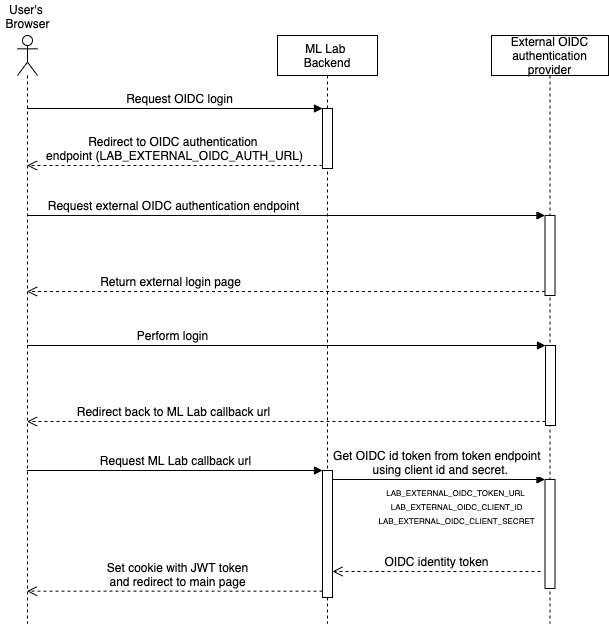

# External OIDC Authentication
By default, ML Lab offers authentication via username and password.
Users are either allowed to self-register or an admin needs to create their account and set an initial password.
This approach is simple but not always the safest as users might choose weak passwords or do not change them regularly.
That is why ML Lab allows the configuration of an external OIDC authentication provider (Azure AD, GitHub, etc.) to delegate the authentication to a third party.
OIDC is a simple identity layer on top of the OAuth 2.0 protocol and is supported by many authentication providers.

## The ML Lab Authentication Flow

The sequence diagram above shows how ML Lab interacts with the external OIDC authentication provider.
After the user visits the login page, the browser is redirected to the external OIDC authentication endpoint which was configured via the environment variable `LAB_EXTERNAL_OIDC_AUTH_URL`.
Once the user authenticated successfully, the browser is redirected back to ML Lab backend.
It uses the configured external OIDC token URL (environment variable `LAB_EXTERNAL_OIDC_TOKEN_URL`), the client ID (environment variable `LAB_EXTERNAL_OIDC_CLIENT_ID`) and client secret (environment variable `LAB_EXTERNAL_OIDC_CLIENT_SECRET`) to request the user's OIDC identity token.
This token contains the user's e-mail address which functions as the username.
An ML Lab JWT token is set as a cookie in the user's browser so ML Lab can be used without further authentication.

## Setup external OIDC authentication with Azure AD
1. Open the Azure portal, navigate to the Azure Active Directory" page and select "App registration" from the left side menu.
2. Click on the "Endpoints" tab.
The value shown for "OAuth 2.0 authorization endpoint (v2)" must be used for the `LAB_EXTERNAL_OIDC_AUTH_URL` environment variable.
The value shown for "OAuth 2.0 token endpoint (v2)" must be used for the `LAB_EXTERNAL_OIDC_TOKEN_URL` environment variable.
3. Click on the tab "New registration" and create a new app registration for ML Lab.
4. On the "Overview" page, copy the value of the "Application (client) ID" field. It will be used for the `LAB_EXTERNAL_OIDC_CLIENT_ID` environment variable.
5. On the left side menu choose "Certificates & secrets" and click on "New client secret". Choose a name and expiration time. After that, copy the value of new newly created client secret.
It will be use for the `LAB_EXTERNAL_OIDC_CLIENT_SECRET` environment variable. The "ID" field is not required.
6. On the left side menu choose "Authentication" and click on "Add a platform".
There choose the "Web" platform and add the callback URL of your ML Lab instance (https://&lt;insert-your-host&gt;/api/auth/oidc/callback). Save your changes afterwards.
7. Now you can install the ML Lab like described [here](../../installation/install-lab/) and set the required environment variables.

## Setup external OIDC authentication with Dex
Dex is and identity service that uses OpenID Connect (OIDC) and provides a range of connectors to other authentication methods like SAML 2.0, LDAP, GitHub Oauth 2.0 and many more.
Detailed information on how to setup Dex can be found here: https://github.com/dexidp/dex
It can be run as a docker container alongside ML Lab.
In the dex configuration file the client id and secret can be specified.
After starting Dex, the authentication and token URL can be found at `/dex/.well-known/openid-configuration`.
