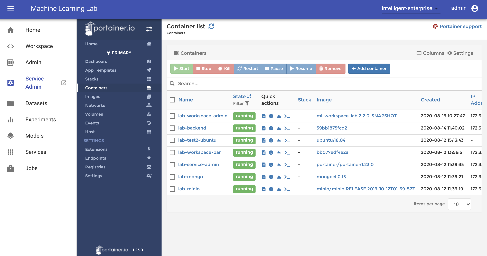

# Manage Services

The service-admin section provides an administration dashboard (via [Portainer](https://www.portainer.io/) in local or Swarm mode or [Kubernetes Dashboard](https://github.com/kubernetes/dashboard) in Kubernetes mode) that can be used by an admin user to manage the Docker resources using a GUI without the need to use the command-line interface.

!!! info
    The Service Admin Dashboard is only accesible if you are logged into Lab as admin user.

For more detailed information on how to manage services, go to the official [Portainer page](https://portainer.io) and visit the [Docker documentation](https://docs.docker.com) or the [Kubernetes documentation](https://kubernetes.io/docs/home/).
