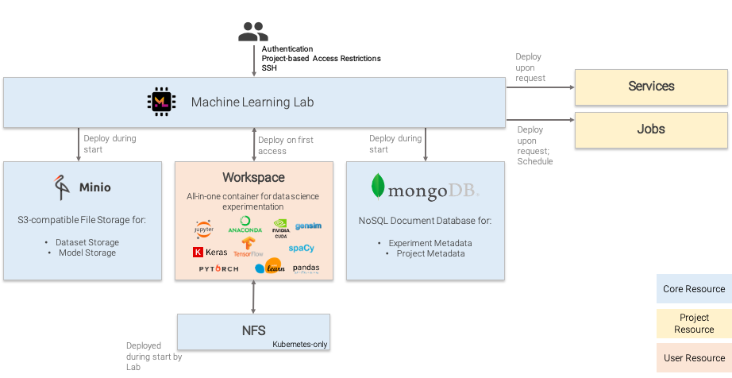
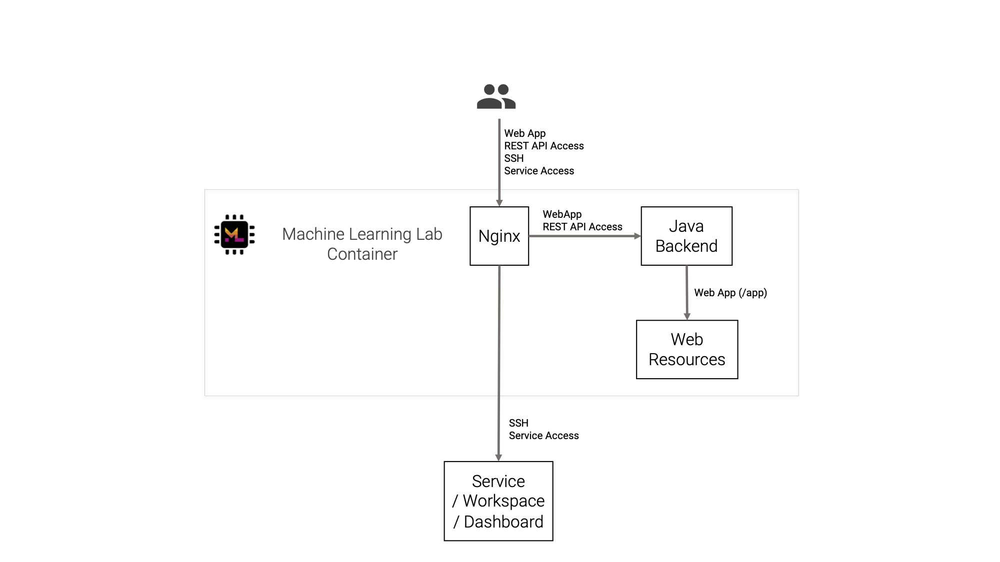
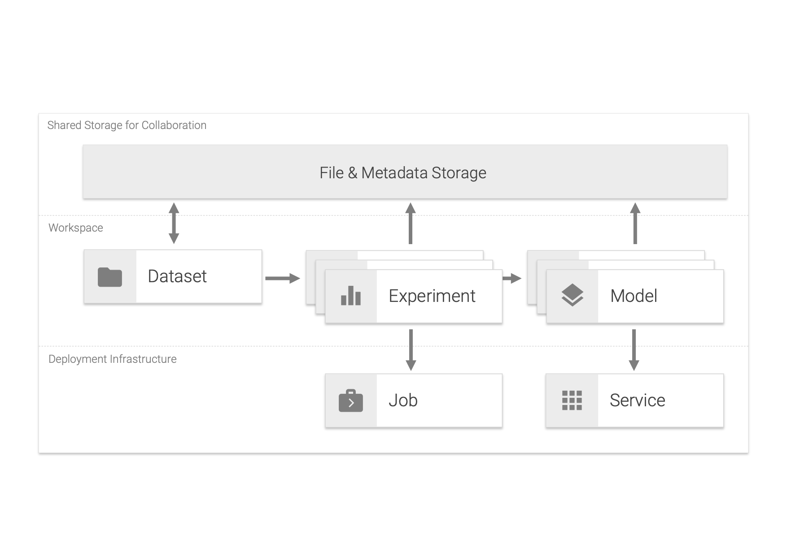

# Architecture

The following figure displays the different resource types managed by the ML Lab container. The resources *Minio*, *Mongo*, and *NFS* exist once.

All traffic goes through the ML Lab container. It was designed to scale horizontally, although this functionality has not been thoroughly tested yet. So far, no performance issues were observed as the heavy load happens inside the Service or Workspace containers, such as running Python code. 

*Workspace* containers are started for each user. Indifinetely *Services* and *Jobs* can exist within each project, only limited by the underlying infrastructure. In Kubernetes, an admin can theoretically scale a single *Service* manually.

By ML Lab created resources follow a naming pattern and are assigned specific labels (Docker & Kubernetes) that assign them to specific projects. By doing so, the capabilities of the underlying infrastructure technology is leveraged.
<!-- and resources are coupled quite loosely, resulting in reduced maintenance on other parts such as databases. -->

The next figure visualizes the most important components within the ML Lab container. Inside of the ML Lab container, the nginx proxy is the first request handler. It determines whether the request goes to the Java backend, which is also hosted inside of the ML Lab container, or whether it goes to another container.

The following diagram shows the routing of requests with respect to the ML Lab container in more detail.

The following figure gives an high-level overview of the concepts that exist withtin the ML Lab world.

