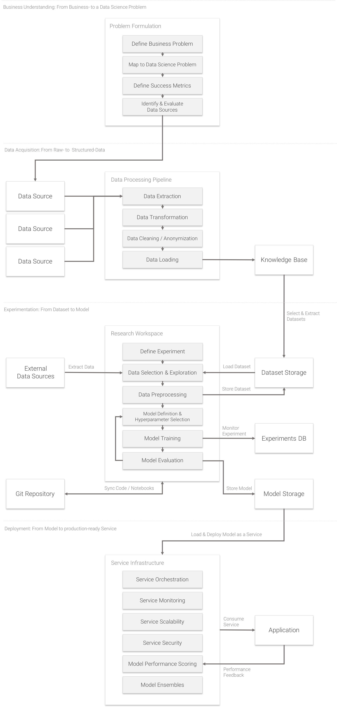

# Machine Learning Lifecycle

The Machine Learning Lifecycle can be unnecessary cumbersome. If you are familiar with data science projects, you were most likely confronted with various of these questions:

- How to provide a multi-user environment for doing machine learning experiments?
- How to efficiently provide computing resources to the data science team?
- How to store datasets and trained models?
- How to organize and monitor experiments?
- How to deploy models and expose models via REST API in a scalable and secure way?
- How to provide GPU access to data science teams?

ML Lab enables teams to be more productive in delivering machine learning technologies for their products and datasets. This platform helps with a variety of common tasks within the machine learning lifecycle as described below. The same general workflow exists across almost all machine learning use cases:

