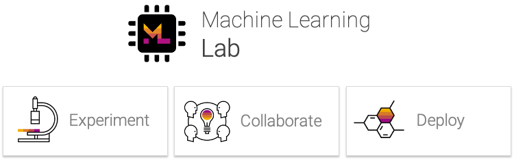

# Welcome to Machine Learning Lab

The ML Lab is a centralized hub for data science teams to seamlessly build, deploy, and operate machine learning solutions at scale. It is designed to cover the end-to-end machine learning lifecycle from data processing and experimentation to model training and deployment. It combines the libraries, languages, and tools data scientists love, with the infrastructure, services and workflows they need to deliver machine learning solutions into production. More information can be found below.

## Features

- Workspace with integrated tooling (Jupyter, Git, Hardware Monitoring, ...)
- Works with any common machine learning framework (Tensorflow, PyTorch, Sklearn, ...)
- Upload, manage, version, and share datasets & models
- Monitor and share experiments for reproducability
- Deploy models as production-ready services
- Deployable on a standalone server or on a cluster (via Docker, Kubernetes)
- and more...

## Screenshots

    <!-- Slides -->
    

    

    

    

    

    <!-- The Arrows -->
    <i class="left" class="arrows" style="z-index:2; position:absolute;"><svg viewBox="0 0 100 100"><path d="M 10,50 L 60,100 L 70,90 L 30,50  L 70,10 L 60,0 Z"></path></svg></i>
    <i class="right" class="arrows" style="z-index:2; position:absolute;"><svg viewBox="0 0 100 100"><path d="M 10,50 L 60,100 L 70,90 L 30,50  L 70,10 L 60,0 Z" transform="translate(100, 100) rotate(180) "></path></svg></i>

Try out the walkthrough [here](./walkthrough/lab-walkthrough/).

## Get Started

If you want to install your own ML Lab instance, visit [this simple installation guide](./getting-started/#install-ml-lab).