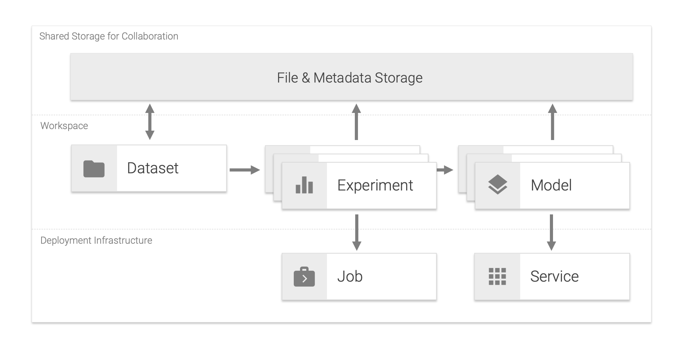

# Core Concepts

## Project

A project is a digital space for tackling a specific data science use-case. It consists of multiple datasets, experiments, models, services, and jobs.

## Dataset

A dataset is a single file that contains raw- or processed-data, usually preselected for a certain experiment. It is recommended to have the dataset in an easily readable format such as CSV for structured data or GraphML for graph data. If your dataset consists of multiple files (e.g. collection of images), we recommend packaging (e.g. via zip) this dataset to a single file. Our python libraries have built-in support for his type of packaged data.

## Experiment

An experiment is a single execution of data science code with specific parameters, data, and results. An experiment in the data science field usually refers to a single model training run, but can also be any other computational task, such as a data transformation run, that requires a certain configuration and has some measurable results. All metadata and artifacts for an experiment such as parameters, timestamp, operator, data & model files, environment information, resulting metrics (e.g. accuracy), and other related information can easily be saved and shared with the experiment to enable reproducibility. During the experimentation process, one or more parameters might be changed by the data scientist in an organized manner, and the effects of these changes on associated metrics should be measured, recorded, and analyzed. Data scientist may try many different approaches, different parameters and fail many times before the required level of a metric is achieved.

## Model

A model is an artifact that is created during the training process. A model is something that predicts an output for a given input. Any file created after training from an ML algorithm is a model. The model needs to be deployed as a service in order to offer the model's prediction capabilities for integration into applications.

## Service

A service is a software component that implements and provides specific capabilities. In our landscape, services are deployed as Docker containers and are usually accessible via a REST API over HTTP(S).

## Job

A job is a software component that runs a finite task for a certain time until completion. Jobs are useful for running experiments, such as model training and data pipelines, or other kinds of large computations and batch-oriented tasks. Besides single execution, a job can also be scheduled for automatic execution based on dependencies to other jobs or run periodically via CRON commands. In our landscape, a job is implemented as a Docker container that is expected to run a finite task (script) that returns a successful or failed exit code after completion. We suggest migrating data processing or model training scripts from the workspace into jobs, once the scripts are ready for production usage. This makes it simple to rerun and schedule your production-ready data pipelines and model trainings.

## Workspace

A place for a data scientist to conduct a set of experiments centered around a given project or problem to solve. It can have many different notebooks and scripts containing different experiments that are carried out as the data scientist seek the best model. The workspace is implemented as an all-in-one web IDE specialized for machine learning and data science.