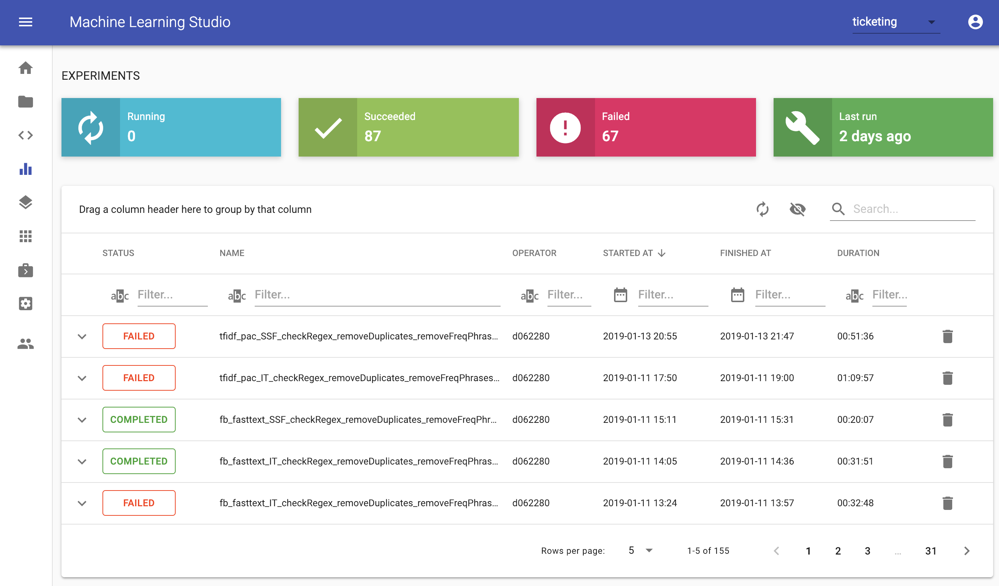
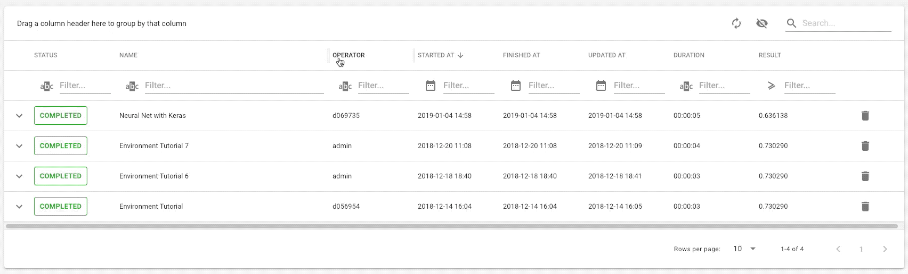
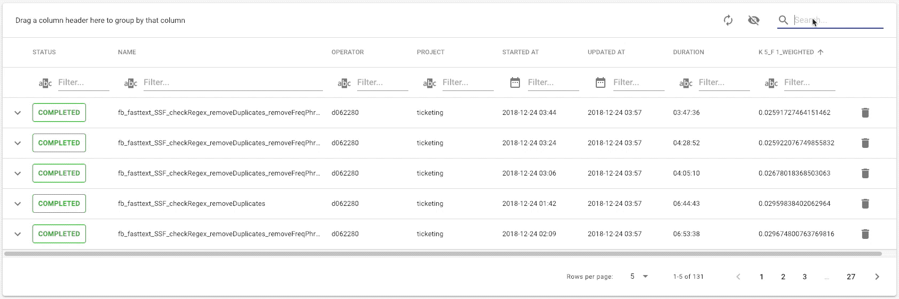
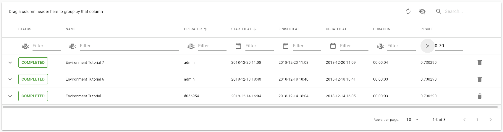
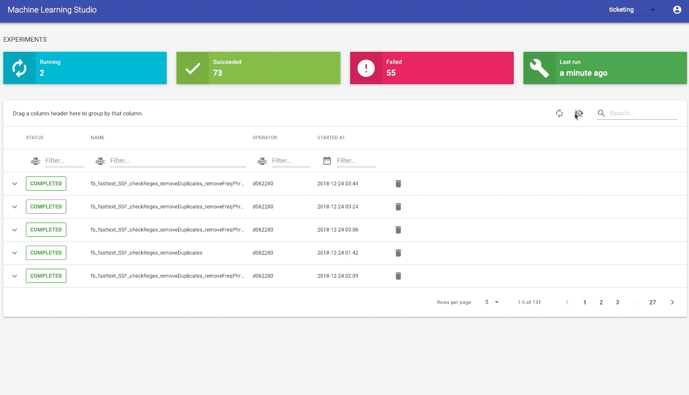
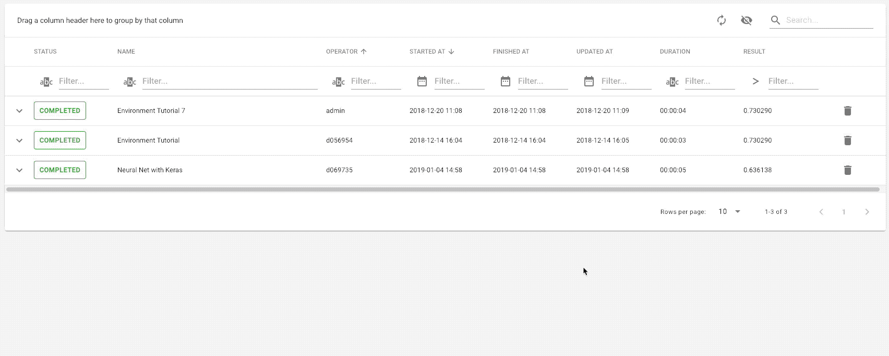

# Experiments Dashboard

The purpose of the Experiment Dashboard is to compare different approaches, such as training different models or hyperparameter tuning based on metrics you can define in your python code. You are responsible for selecting the metric suitable for your challenge you want to tackle, for example: Accuracy, Recall, F1-measurement. Besides the main comparison metric, you can store arbitrary metrics as well as other information, such as timestamp, operator, data & model files, environment information. You can then use the dashboard to compare the information belonging to experiments.

## Overview

Above the dashboard you can see meta information of all experiments that have run. An experiment itself is a row and can have attributes that are shown as columns. Each experiment has a status, indicating whether the experiment has completed, failed, or is still running. There are also other status such as dead, queued, and interrupted. Those can occur by the nature of Jupyter notebook kernels.

## Expendable Rows

To get an idea of what you can track, you can expand the row to have a more consolidated view on different information types.

<!-- 

 -->

Not only can you find all the defined metrics for your experiment but also dependencies, used artifacts, host information (such as CPU, OS, number of cores, python version, workspace version and number of GPUs), Git information and all defined parameters and files that you can download directly. To improve reproducibility, you can store your datasets you used for training and testing your model here, so that others easily can take the same dataset you used.

## Grouping

Another handy feature of the Experiment Dashboard is the grouping of attributes. You can easily group attributes, resulting in a tree view. This makes it easy to group experiments by operators of the project, status, or parameters. Additionally, it is possible to combine attributes leading to a nested tree view.

<!-- 

 -->

## Search

Within the Dashboard you have two options to filter for specific values. Either you use the overall search for any string matching each column, as shown in the gif below or you use filters dedicated for a specific column.

<!-- 

 -->

The latter comes with the advantage that you can use comparative expressions. By clicking on the icon filter of the result column, you can choose operands such as greater than, greater, less and so on. By now, there are custom filters for date, text, and numbers.

<!-- 

 -->

## Attribute Selection

By default you are looking at the Dashboard with a basic set of columns. Those were curated by us as we think they give a good overview at the first glance. In case you want to compare other attributes as well, like parameters or metrics, you can do so by choosing them after clicking on the **Columns button**. We gathered all attributes based on the experiments you have run so far at this point, meaning there will only attributes show up you used once.

<!-- 

 -->

## Delete Experiments

Sometimes things do not go as expected, e.g. the kernel died because of a memory leak or you had to interrupt the experiment. This might add up and lead to a bunch of useless entries and a messy history. You can delete experiments by clicking on the button at the very right end of the failed experiment.

<!-- 

 -->