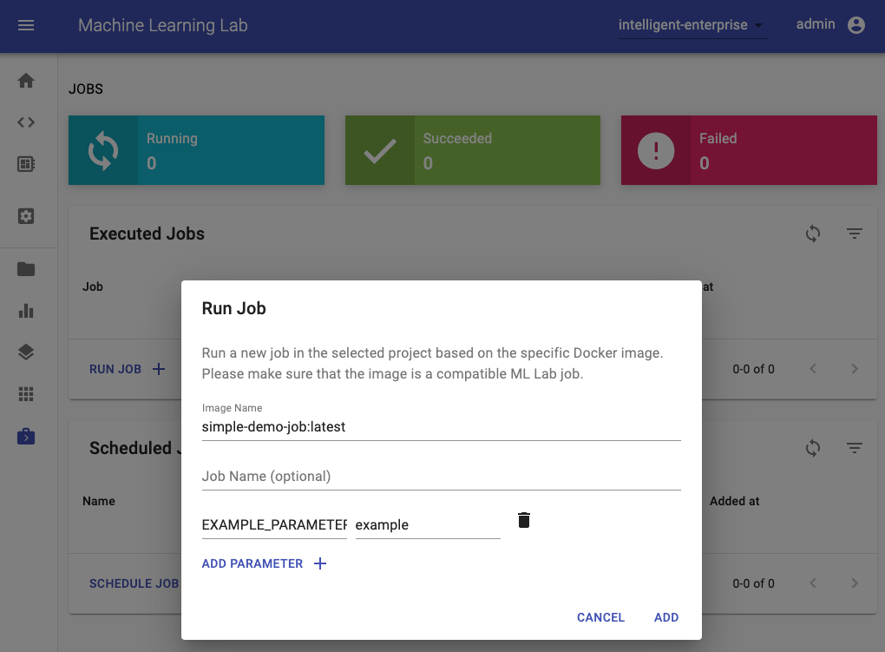
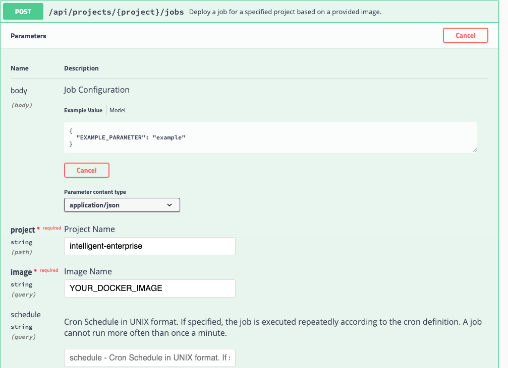

# How to create a Job

A job is a software component that runs a finite task for a certain time to completion. Jobs are useful for running experiments, such as model training and data pipelines, or other kinds of large computations and batch-oriented tasks. We suggest migrating data processing or model training scripts from the workspace into jobs, once the scripts are ready for production usage. This makes it simple to rerun and schedule your production-ready data pipelines and model trainings.

## Minimum Requirements

A job is required to be implemented as a **Docker container** that is expected to run a finite task that returns a successful or failed exit code after completion. Furthermore, we advise that the job image adheres [common docker standards](https://docs.docker.com/develop/develop-images/dockerfile_best-practices/) and [best practices](#best-practices).

!!! info "Status Codes"
    Your job should return the right status code once it is finished. A status code of **0 means the job succeeded**. A status code different to 0 means, the job failed.

Since we only require the job to be a Docker container, there are no technological restrictions on how the task is implemented (e.g. python/bash/java script).

### Default Configuration

If a connection to an ML Lab instance is required, the job should make use of the following set of environment variables that are automatically passed to the job if started from ML Lab:

<table>
    <tr>
        <th>Variable</th>
        <th>Description</th>
        <th>Default</th>
    </tr>
    <tr>
        <td>LAB_ENDPOINT</td>
        <td>Endpoint URL of an ML Lab instance.</td>
        <td>(optional)</td>
    </tr>
    <tr>
        <td>LAB_API_TOKEN</td>
        <td>API Token to access the REST API of an ML Lab instance.</td>
        <td>(optional)</td>
    </tr>
    <tr>
        <td>LAB_PROJECT</td>
        <td>Specified project of an ML Lab Instance.</td>
        <td>(optional)</td>
    </tr>
</table>

The [lab python client](../lab-python-client) and the [lab java client](../how-to-create-a-service/#environment) will automatically use those environment variables to initialize a connection to Lab.

### Best Practices

We have a few best practices which we recommend to apply for developing your jobs:

- Always specify container parameters with default values directly inside the Dockerfile (`ENV EXAMPLE=example`)
- Prefix internal environment variables that should not be changed with an underscore (`_RESOURCE_PATH`)
- If the container has data that needs to be persisted put them int the `/data` folder (this is the default folder to be mounted).
- Use default `stdout` for logging as explained in the [Docker documenation](https://docs.docker.com/config/containers/logging/).
- If possible, use Ubuntu as base image.

## Job Deployment

To be able to deploy a job to Lab or any other Docker/Kubernetes infrastructure, the job image needs to be pushed to an accessible Docker registry such as [Docker Hub](https://hub.docker.com/).

### ML Lab

The easiest way to run a job in an ML Lab instance is via the Jobs UI by providing the job image and, optionally, a name and parameters (environment variables):

[](./images/jobs-deploy-job-ui.png)

Besides single-run execution, a job can also be scheduled using the [UNIX CRON definition](http://www.adminschoice.com/crontab-quick-reference). A scheduled job will run at approximately the given time, with a possible delay of seconds/minutes.

As an alternative, you can also use the `POST /lab/projects/{project}/jobs` REST API method of Lab to programmatically run or schedule a job.

[](./images/jobs-deploy-job-api.png)

Additionaly, you can also use the Python client to deploy a job to any Lab instance as shown below:

```python
from lab_client import Environment
env = Environment(project="<LAB_PROJECT>",
                  lab_endpoint="<LAB_ENDPOINT_URL>",
                  lab_api_token="<LAB_API_TOKEN>"
                 )

from lab_client.handler.lab_job_handler import LabJobConfig, LabJobHandler
job_handler = LabJobHandler(env)

# Configure the job
demo_job = LabJobConfig(
    image="<YOUR_JOB_DOCKER_IMAGE>",
    name="my-job",
    params= {
        "EXAMPLE_PARAMETER": "example"
    }
)

# Run the job. To run the job in background, set check_status to False.
job_handler.run_job(demo_job, check_status=True)
```

### Docker Infrastructure

Since the job is just a normal Docker container, you can run it on any Docker infrastructure via [`docker run`](https://docs.docker.com/engine/reference/run/) and provide the required parameters via `--env`:

``` bash
docker run -d --env EXAMPLE_PARAMETER=example <YOUR_JOB_DOCKER_IMAGE>
```

### Kubernetes Infrastructure

For Kubernetes, please refer to [this guide](https://kubernetes.io/docs/reference/kubectl/docker-cli-to-kubectl/).

## Run job via workspace image

The workspace image can also be used to execute arbitrary Python code without starting any of the preinstalled tools. This provides a seamless way to productize your ML projects since the code that has been developed interactively within the workspace will have the same environment and configuration when run as a job via the same workspace image. To run Python code as a job, you need to provide a path or URL to a code directory (or script) via `EXECUTE_CODE`. The code can be either already mounted into the workspace container or downloaded from a version control system (e.g., git or svn) as described in the following sections. The selected code path needs to be python executable. In case the selected code is a directory (e.g., whenever you download the code from a VCS) you need to put a `__main__.py` file at the root of this directory. The `__main__.py` needs to contain the code that starts your job.

### Run code from version control system

You can execute code directly from Git, Mercurial, Subversion, or Bazaar by using the pip-vcs format as described in [this guide](https://pip.pypa.io/en/stable/reference/pip_install/#vcs-support). For example, to execute code from a [subdirectory](https://github.com/ml-tooling/ml-workspace/tree/develop/docker-res/tests/ml-job) of a git repository, just run:

```bash
docker run --env EXECUTE_CODE="git+https://github.com/ml-tooling/ml-workspace.git#subdirectory=docker-res/tests/ml-job" mltooling/ml-workspace:latest
```

!!! info "Select branches, commits, or tags"
    For additional information on how to specify branches, commits, or tags please refer to [this guide](https://pip.pypa.io/en/stable/reference/pip_install/#vcs-support).

### Run code mounted into workspace

In the following example, we mount and execute the current working directory (expected to contain our code) into the `/workspace/ml-job/` directory of the workspace:

```bash
docker run -v "${PWD}:/workspace/ml-job/" --env EXECUTE_CODE="/workspace/ml-job/" mltooling/ml-workspace:latest
```

### Run code from Lab data

You can also run the job via data uploaded to Lab (single script or packaged code) by specifing the key via the `EXECUTE_CODE` variable.

### Install Dependencies

In the case that the preinstalled workspace libraries are not compatible with your code, you can install or change dependencies by just adding one or multiple of the following files to your code directory:

- `requirements.txt`: [pip requirements format](https://pip.pypa.io/en/stable/user_guide/#requirements-files) for pip-installable dependencies.
- `environment.yml`: [conda environment file](https://docs.conda.io/projects/conda/en/latest/user-guide/tasks/manage-environments.html?highlight=environment.yml#creating-an-environment-file-manually) to create a separate Python environment.
- `setup.sh`: A shell script executed via `/bin/bash`.

The execution order is 1. `environment.yml` -> 2. `setup.sh` -> 3. `requirements.txt`

### Test job in interactive mode

You can test your job code within the workspace (started normally with interactive tools) by executing the following python script:

```bash
python /resources/scripts/execute_code.py /path/to/your/job
```

### Build a custom job image

It is also possible to embed your code directly into a custom job image, as shown below:

```dockerfile
FROM mltooling/ml-workspace:latest

# Add job code to image
COPY ml-job /workspace/ml-job
ENV EXECUTE_CODE=/workspace/ml-job

# Install requirements only
RUN python /resources/scripts/execute_code.py --requirements-only

# Execute only the code at container startup
CMD ["python", "/resources/docker-entrypoint.py", "--code-only"]
```
