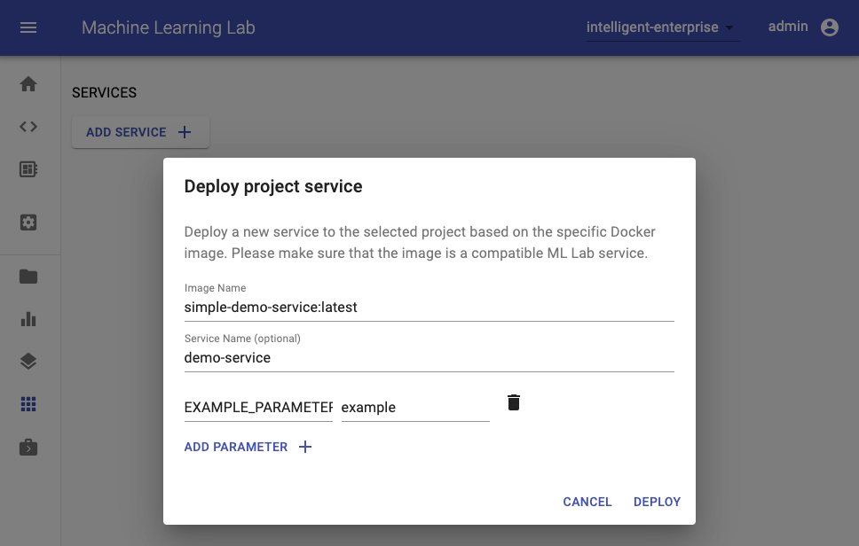
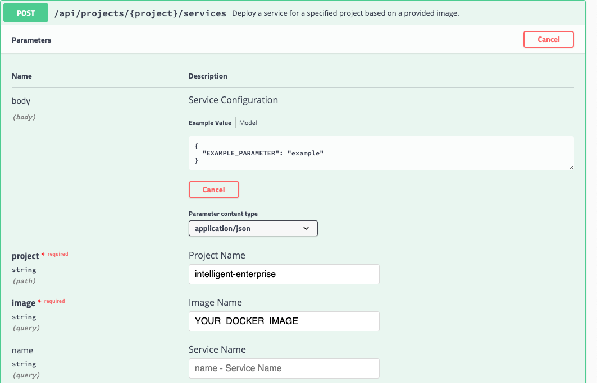

# How to create a Service

A service is a software component that implements and provides specific capabilities. Usually, a service provides REST APIs over HTTP(S) but can also provide other types of protocols that can be served through a TCP port. In the context of machine learning, a service is usually used to make trained models accessible for integration into applications.

If your goal is to deploy a model that was trained with a Python framework, the easiest way is to use the [Unified Model Library](../unified-model-library). If you want to build your own custom ML Lab compatible service, you are at least required to fulfill a small set of [minimum requirements](#minimum-requirements).

## Minimum Requirements

A service is required to be implemented as a **Docker container** that is expected to have at least one HTTP server exposed on any given port. Furthermore, we advise that the service image adheres [common docker standards](https://docs.docker.com/develop/develop-images/dockerfile_best-practices/) and [best practices](#best-practices).

!!! info "Expose Ports"
    All ports that need to be exposed are required to be mentioned via the [`EXPOSE` instruction](https://docs.docker.com/engine/reference/builder/#expose) inside the Dockerfile.

Since we only require the service to be a Docker container, there are no technological restrictions on how the service is implemented (e.g. python/bash/java server). 

A service deployed in an ML Lab project is only accessible from a **relative path** (as explained below) and requires a valid API token (via Authorization header, cookie, or get-parameter) to be accessed. You can get the API token in the user menu (top-right corner -> `Get Project API Token`).

### Default Configuration

If a connection to an ML Lab instance is required, the service should make use of the following set of environment variables that are automatically passed to the service if started from within the web app:

<table>
    <tr>
        <th>Variable</th>
        <th>Description</th>
        <th>Default</th>
    </tr>
    <tr>
        <td>LAB_ENDPOINT</td>
        <td>Endpoint URL of an ML Lab instance.</td>
        <td>(optional)</td>
    </tr>
    <tr>
        <td>LAB_API_TOKEN</td>
        <td>API Token to access the REST API of an ML Lab instance.</td>
        <td>(optional)</td>
    </tr>
    <tr>
        <td>LAB_PROJECT</td>
        <td>Specified project of an ML Lab Instance.</td>
        <td>(optional)</td>
    </tr>
    <tr>
        <td>LAB_SERVICE_PATH</td>
        <td>Base URL path to reach the service within ML Lab. The container internal port for the given endpoint needs to be added to this path as well.</td>
        <td>(optional)</td>
    </tr>
</table>

The [lab python client](../lab-python-client) and the lab java client will automatically use those environment variables to initialize a connection to ML Lab.

### Best Practices

We have a few best practices which we recommend to apply for developing your service:

- Always specify container parameters with default values directly inside the Dockerfile (`ENV EXAMPLE=example`)
- Prefix internal environment variables that should not be changed with an underscore (`_RESOURCE_PATH`)
- Use the [`EXPOSE` instruction](https://docs.docker.com/engine/reference/builder/#expose) in the Dockerfile to make all required ports of your service available.
- If the container has data that needs to be persisted put them int the `/data` folder (this is the default folder to be mounted).
- If there is a way to check the health status of your service, implement the [`HEALTHCHECK` instruction](https://docs.docker.com/engine/reference/builder/#healthcheck) in the Dockerfile.
- Use default `stdout` for logging as explained in the [Docker documenation](https://docs.docker.com/config/containers/logging/).
- If possible, use Ubuntu as base image.

### Example Services

We prepared a few simple examples of valid Docker images for services with different Python web frameworks:

- [Fastapi Example](TODO): `TODO`
- [Flask Example](TODO): `TODO`
- [Flask-RESTPlus Example](TODO): `TODO`

We recommend to use [Fastapi](https://github.com/tiangolo/fastapi) for building your REST APIs.

## Service Deployment

To be able to deploy a service to ML Lab or any other Docker/Kubernetes infrastructure, the service image needs to be pushed to an accessible Docker registry such as [Docker Hub](https://hub.docker.com/).

### ML Lab

The easiest way to deploy a service in an ML Lab instance is via the Services UI by providing the service image and, optionally, a name and parameters (environment variables):

[](./images/services-deploy-service-ui.png)

As an alternative, you can also use the `POST /api/projects/{project}/services` REST API method of ML Lab to programmatically deploy a service.

[](./images/services-deploy-service-api.png)

Additionaly, you can also use the Python client to deploy a service to any ML Lab instance as shown below:

```python
from lab_client import Environment
env = Environment(project="<LAB_PROJECT>",
                  lab_endpoint="<LAB_ENDPOINT_URL>",
                  lab_api_token="<LAB_API_TOKEN>"
                 )

# Deploy a Service
env.lab_handler.lab_api.deploy_service(
                  project=env.project,
                  image="<YOUR_SERVICE_DOCKER_IMAGE>",
                  name="my-service",
                  # Provide service configuration in request body
                  body= {
                      "EXAMPLE_PARAMETER": "example"
                  })
```

Once the service is deployed, it is accessible from the following URL path: `/api/projects/<PROJECT>/services/<SERVICE_NAME>/<PORT>/`. This means that a service can only be used when it is deployed via ML Lab if it is able to serve its content from a relativ path. Furthermore, every so deployed service is secured. Therefore, a valid ML Lab API token is required to access the service via the mentioned URL. Please provide a valid user or project API token via the `Authorization` header in this format: `Bearer YOUR_API_TOKEN`. You can get your API token in the user menu (top-right corner) of Lab. As an alternative to the `Authorization` header, you can also provide the API token via cookie (`lab_access_token`) or via get paramter in the URL (`lab_token`).

!!! info "API token via URL parameter"
    Setting the API token via URL parameter will set the `lab_access_token` at the first request and, thereby, logs the user out, in case the user accessing the link is logged into the same ML Lab instance.

### Docker Infrastructure

Since the service is just a normal Docker container, you can run it on any Docker infrastructure via [`docker run`](https://docs.docker.com/engine/reference/run/) by exposing all marked ports via `-P`. Required parameters (configuration) can be provided via `--env`:

``` bash
docker run -d -P --env EXAMPLE_PARAMETER=example <YOUR_SERVICE_DOCKER_IMAGE>
```

### Kubernetes Infrastructure

For Kubernetes, please refer to [this guide](https://kubernetes.io/docs/reference/kubectl/docker-cli-to-kubectl/).

## Run service via workspace image

The workspace image can also be used to execute arbitrary Python code without starting any of the preinstalled tools. This provides a seamless way to productize your ML projects since the code that has been developed interactively within the workspace will have the same environment and configuration when run as a service via the same workspace image. To run Python code as a service, you need to provide a path or URL to a code directory (or script) via `EXECUTE_CODE`. The code can be either already mounted into the workspace container or downloaded from a version control system (e.g., git or svn) as described in the following sections. The selected code path needs to be python executable. In case the selected code is a directory (e.g., whenever you download the code from a VCS) you need to put a `__main__.py` file at the root of this directory. The `__main__.py` needs to contain the code that starts your service.

!!! info "Server on port 8091"
    The code is expected to start a server on port 8091, since a service requires a running HTTP server.

### Run code from version control system

You can execute code directly from Git, Mercurial, Subversion, or Bazaar by using the pip-vcs format as described in [this guide](https://pip.pypa.io/en/stable/reference/pip_install/#vcs-support). For example, to execute code from a [subdirectory](https://github.com/ml-tooling/ml-workspace/tree/develop/docker-res/tests/ml-service) of a git repository, just run:

```bash
docker run -p 8091:8091 --env EXECUTE_CODE="git+https://github.com/ml-tooling/ml-workspace.git#subdirectory=docker-res/tests/ml-service" mltooling/ml-workspace:latest
```

!!! info "Select branches, commits, or tags"
    For additional information on how to specify branches, commits, or tags please refer to [this guide](https://pip.pypa.io/en/stable/reference/pip_install/#vcs-support).

### Run code mounted into workspace

In the following example, we mount and execute the current working directory (expected to contain our code) into the `/workspace/ml-service/` directory of the workspace:

```bash
docker run -p 8091:8091 -v "${PWD}:/workspace/ml-service/" --env EXECUTE_CODE="/workspace/ml-service/" mltooling/ml-workspace:latest
```

### Run code from ML Lab data

You can also run the service via data uploaded to ML Lab (single script or packaged code) by specifing the key via the `EXECUTE_CODE` variable.

### Install Dependencies

In the case that the preinstalled workspace libraries are not compatible with your code, you can install or change dependencies by just adding one or multiple of the following files to your code directory:

- `requirements.txt`: [pip requirements format](https://pip.pypa.io/en/stable/user_guide/#requirements-files) for pip-installable dependencies.
- `environment.yml`: [conda environment file](https://docs.conda.io/projects/conda/en/latest/user-guide/tasks/manage-environments.html?highlight=environment.yml#creating-an-environment-file-manually) to create a separate Python environment.
- `setup.sh`: A shell script executed via `/bin/bash`.

The execution order is 1. `environment.yml` -> 2. `setup.sh` -> 3. `requirements.txt`

### Test service in interactive mode

You can test your service code within the workspace (started normally with interactive tools) by executing the following python script:

```bash
python /resources/scripts/execute_code.py /path/to/your/service
```

### Build a custom service image

It is also possible to embed your code directly into a custom service image, as shown below:

```dockerfile
FROM mltooling/ml-workspace:latest

# Add service code to image
COPY ml-service /workspace/ml-service
ENV EXECUTE_CODE=/workspace/ml-service

# Install requirements only
RUN python /resources/scripts/execute_code.py --requirements-only

# Execute only the code at container startup
CMD ["python", "/resources/docker-entrypoint.py", "--code-only"]
```
