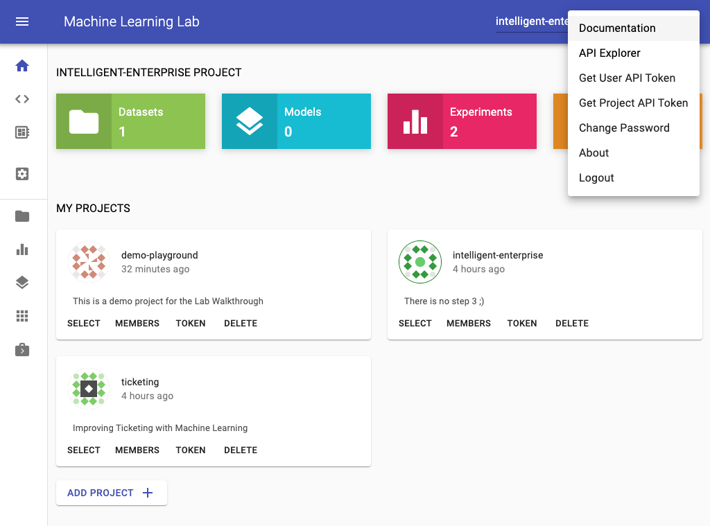
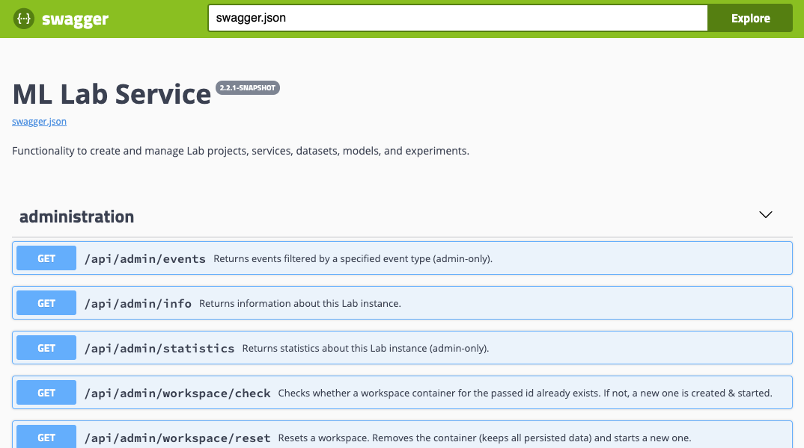

# Lab REST API

You can access the Lab REST API documentation by selecting `Lab API Explorer` in the menu.

The Lab REST API provides all the functionality to create and manage Lab projects, services, datasets, models, experiments, and users. 

!!! tip
    If you are logged into the Lab, your API token will be automatically used when calling a function from the API explorer.

The [Lab Python Client](../lab-python-client/) provides a full python client for this REST API.