# Introduction to the Workspace

The workspace is an all-in-one web IDE specialized for machine learning and data science. It comes with Jupyter Notebook, a Desktop GUI, Git Integration, Tensorboard Integration, Hardware Monitoring, and many common ML libraries. It is also project-independent, therefore, you will use the same workspace for all of the projects within the given ML Lab instance. The workspace you’re using, including any custom files and libraries that you have setup, will not be accessible by any other user. The workspace is pre-installed with a variety of common data science libraries and features such as Tensorflow, Pytorch, Keras, Sklearn, XGboost, and many more.

## Jupyter Basics

Jupyter Notebook (the application you are currently using) is a web-based interactive environment for writing and running code. The main building blocks of Jupyter are the file-browser, the notebook editor, and kernels. The file-browser provides an interactive file manager for all notebooks, files, and folders in the `/workspace` directory.

[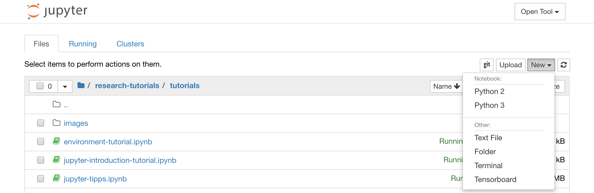](images/welcome-jupyter-tree.png)

A new notebook can be created by clicking on the `New` drop-down button at the top of the list and selecting the desired language kernel.

!!! tip "Terminal"
    You can spawn interactive terminal instances as well by selecting `New -> Terminal` in the file-browser.

[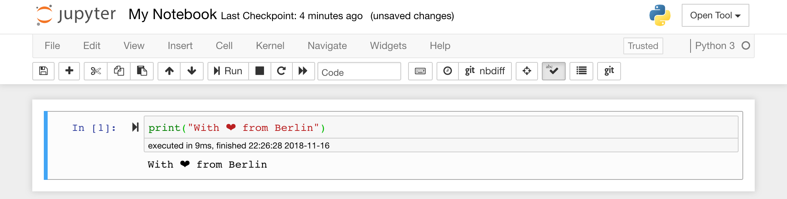](images/welcome-jupyter-notebook.png)

The notebook editor enables users to author documents that include live code, markdown text, shell commands, LaTeX equations, interactive widgets, plots, and images. These notebook documents provide a complete and self-contained record of a computation that can be converted to various formats and shared with others.

An interactive tour of the notebook UI can be started by selecting `Help -> User Interface Tour` from the notebook menu bar. If you are a first-time Jupyter user, you can find a more detailed introduction in the `Jupyter Basics Tutorial` inside your workspace as well.

!!! tip "Extensions"
    The workspace has a variety of third-party Jupyter extensions activated. You can configure these extensions in the nbextensions configurator: `Edit -> nbextensions config`

The Notebook allows code to be run in a range of different programming languages. For each notebook document that a user opens, the web application starts a **kernel** that runs the code for that notebook and returns output. The workspace has a Python 3 and Python 2 kernel pre-installed. Additional Kernels can be installed to get access to other languages (R, Scala, Go, ...) or additional computing resources (GPUs, CPUs, Memory, ...).

!!! info "Python 2 Support"
    Python 2 support is deprecated and not fully supported. Please only use Python 2 if necessary!

## /workspace Folder

The default work directory is `/workspace` which is also the root directory of the Jupyter instance. Everything in that directory is persisted on the underlying host and backed up to the configured ML Lab instance every day.

!!! info "Data Persistence"
    Use the `/workspace` directory for all your important work artifacts! Data within other directories might get lost.

## Install Dependencies

Within your workspace you have full root & sudo access to install any library or tool you need by using `!pip install` or `!apt-get install` inside the notebook, as shown below:

```bash
!pip install matplotlib-venn
```

!!! tip "Install Dependencies in Notebook"
    It’s a good idea to include cells which install and load any custom libraries or files (which are not pre-installed in the workspace) that your notebook needs.

## Connect to ML Lab

The workspace has a python lab-client library pre-installed which provides easy access to the ML Lab API and capabilities to download/upload data, and run experiments. Below is a sneak peak into how you can use this library. To be able to execute this code, please replace `LAB_PROJECT` with one of your projects on the connected ML Lab instance and upload [this dataset](../walkthrough/data/download-dataset.html) to the connected project from dataset section of the ML Lab UI.

!!! info
    To run this code you need to have created a project and uploaded the provided dataset file to the ML Lab instance!

```python
from lab_client import Environment
import random

# Initialize environment
env = Environment(project="LAB_PROJECT",  # ML Lab project you want to work on
                  # Only required in stand-alone workspace deployments
                  # lab_endpoint="LAB_ENDPOINT",
                  # lab_api_token="LAB_TOKEN"
                 )

# Show environment information
env.print_info()

# Create experiment
exp = env.create_experiment('Welcome Tutorial')

# Get file (make sure that you have uploaded the dataset in the connected project)
text_corpus_path = env.get_file('datasets/news-categorized.csv')

# Define experiment
def shuffle_lines(exp, params, artifacts):
    # for this example we will just shuffle all lines in a file
    random.seed(params["seed"])
    lines = open(text_corpus_path).readlines()
    random.shuffle(lines)
    shuffeled_file_path = exp.create_file_path("shuffled_corpus.csv")
    open(shuffeled_file_path, 'w').writelines(lines)

    # log metadata
    exp.log_metric("lines", len(lines))

    # upload data
    env.upload_file(shuffeled_file_path, "dataset")

# Define parameter configuration for experiment run
params = {
    'seed': 1
}

# Run experiment and automatically sync all metadata
exp.run_exp(shuffle_lines, params)

# show experiment info
# The same information are accesible from the experiment dashboard in Lab
exp.print_info()
```

More information about the lab-client library are available in the [Lab Python Client](../lab-python-client) section.

## Deploy Locally

If you want to deploy the workspace stand-alone on your computer, just execute the following command:

```bash
docker run -d -v /some/host/path:/workspace -p 8080:8080 mltooling/ml-workspace:latest
```

Most recent version: 1.1.2  
The mount is there in case you want to persist all notebooks and files under `/workspace` on the host filesystem.

If you want to connect to an ML Lab project, you can use our [Python library](lab-python-client/) also in this setup.

### Parameters

To limit cpu and memory etc., you can pass Docker-specific flags to the container as stated [in the Docker documentation](https://docs.docker.com/config/containers/resource_constraints/).
You can also pass following environment variables to configure things such as basic authentication etc.:

<table>
    <tr>
        <th>Variable</th>
        <th>Description</th>
        <th>Default</th>
    </tr>
    <tr>
        <td>SERVICE_SSL_ENABLED</td>
        <td>Enable or disable SSL. When set to true, either certifcates must be mounted to SSL_RESOURCES_PATH or, if not, the container generates own certificates.</td>
        <td>false</td>
    </tr>
    <tr>
        <td>SSL_RESOURCES_PATH</td>
        <td>The container path where the SSL certficate files <i>cert.key</i> and <i>cert.crt</i> are mounted.</td>
        <td>/resources/ssl</td>
    </tr>
    <tr>
        <td>SERVICE_AUTH_ENABLED</td>
        <td>Enable or disable basic authentication. If enabled, also SERVICE_USER and SERVICE_PASSWORD should be set.</td>
        <td>false</td>
    </tr>
    <tr>
        <td>SERVICE_USER</td>
        <td>Basic auth user name. Only used when SERVICE_AUTH_ENABLED is true.</td>
        <td>user</td>
    </tr>
    <tr>
        <td>SERVICE_PASSWORD</td>
        <td>Basic auth password. Only used when SERVICE_AUTH_ENABLED is true.</td>
        <td>user</td>
    </tr>
      <tr>
        <td>WORKSPACE_BASE_URL</td>
        <td>The base URL under which the notebook server is reachable. E.g. setting it to /workspace, the workspace would be reachable under /workspace/tree</td>
        <td>/</td>
    </tr>
    <tr>
        <td>WORKSPACE_STORAGE_LIMIT</td>
        <td>The storage limit which will cause a pop-up to occur to remind the user to delete files. If not set, there is no limit</td>
        <td></td>
    </tr>
    <tr>
        <td>NOTEBOOK_ARGS</td>
        <td>Additional flags that are passed to the jupyter notebook server on start separated by whitespace, e.g. --MappingKernelManager.cull_idle_timeout=172800. Has to take the form "--MappingKernelManager.cull_idle_timeout=172800 --MappingKernelManager.cull_connected=True"</td>
        <td></td>
    </tr>
</table>

## Integrated Tools

---

In addition to the VNC access and Git Integrations, the workspace is equipped with a selection of common tools to help with the data science and experimentation workflow. Many of these tools can be started from the `Open Tools` menu.

[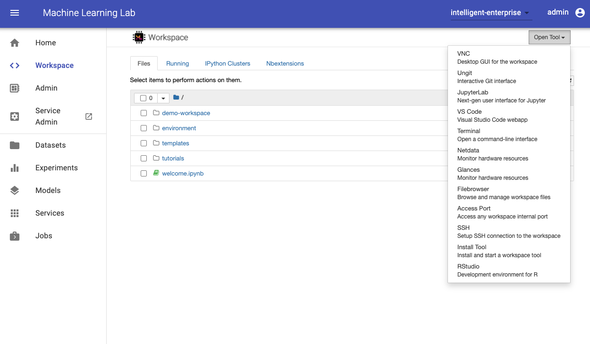](../images/lab-workspace.png)

### Desktop GUI

The workspace provides an HTTP-based VNC access to the workspace via [noVNC](https://github.com/novnc/noVNC). Thereby, you can access and work within the workspace with a fully featured desktop GUI. To access this desktop GUI, go to `Open Tools`, select `VNC`, and click the `Connect` button. In the case you are asked for a password, use `vncpassword`. Once you are connected, you will see a desktop GUI that allows you to install and use advanced tools such as PyCharm, Visual Studio Code, Spyder and many more.

[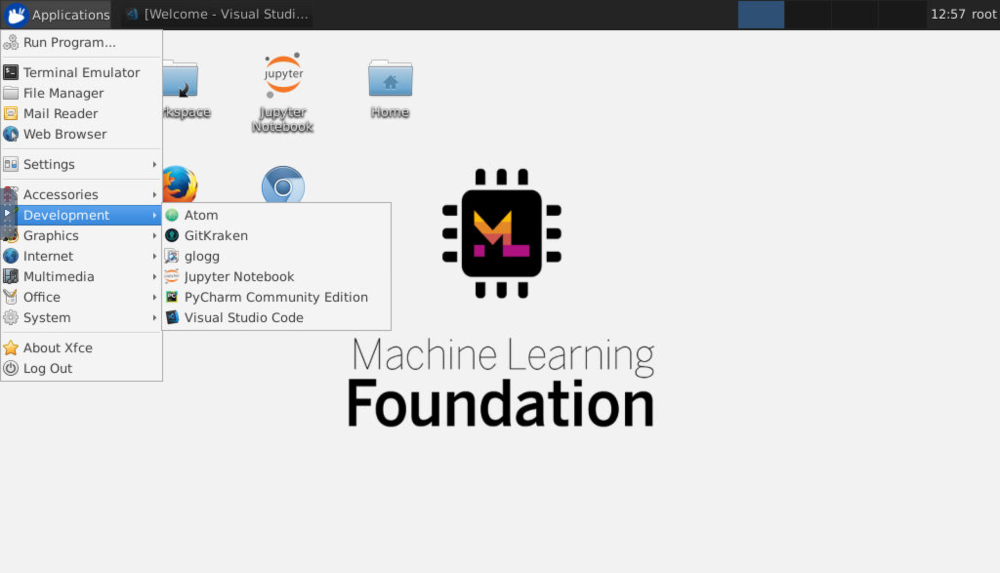](images/welcome-vnc-gui.png)

**Clipboard:** If you want to share the clipboard between your computer and the workspace, you can use the copy-paste functionality as described below:

[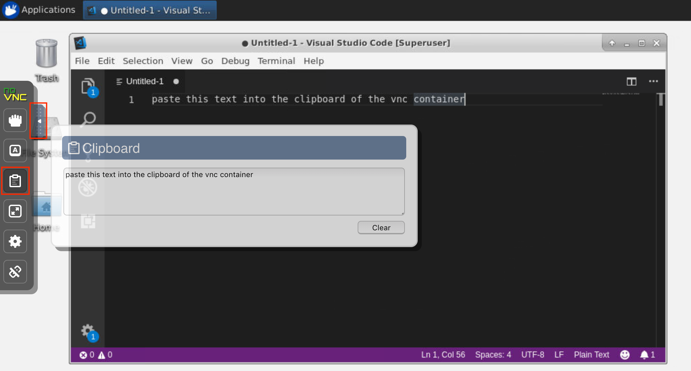](images/welcome-vnc-clipboard.png)

!!! tip "Long-running tasks"
    Use the desktop GUI for long-running Jupyter executions. By running notebooks from the browser of your workspace desktop GUI, all output will be synchronized to the notebook even if you have disconnected your computer from the notebook.

### Git Integration

Version control is a crucial aspect in collaboration. To make this process as smooth as possible, we have integrated a Jupyter plugin specialized on pushing notebooks, a full-fledged web-based Git client (ungit), as well as a notebook merging tool (nbdime).

#### Clone Repository

To clone a Git repository, you can either use `https` with authentication via credentials or `ssh` with authentication via public key. For cloning repositories via `https`, we recommend to use Ungit (`Open Tool -> Ungit`) as shown below. If authentication is required, you will get asked for your credentials.

[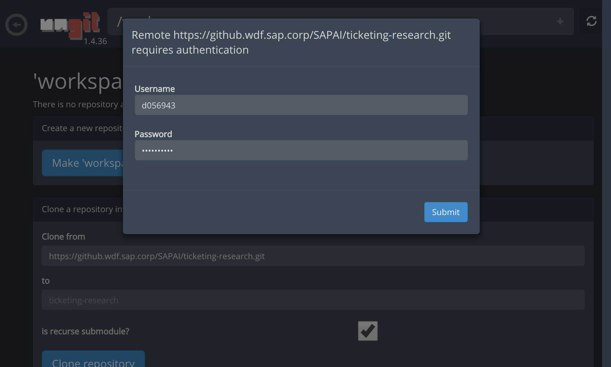](images/welcome-ungit-auth.png)

If you prefer authentication via `ssh` public key, we recommend to use the clone functionality of the Jupyter Git plugin as shown below. If authentication is required, the plugin will generate an ssh key that you have to add to your account on the Git server.

[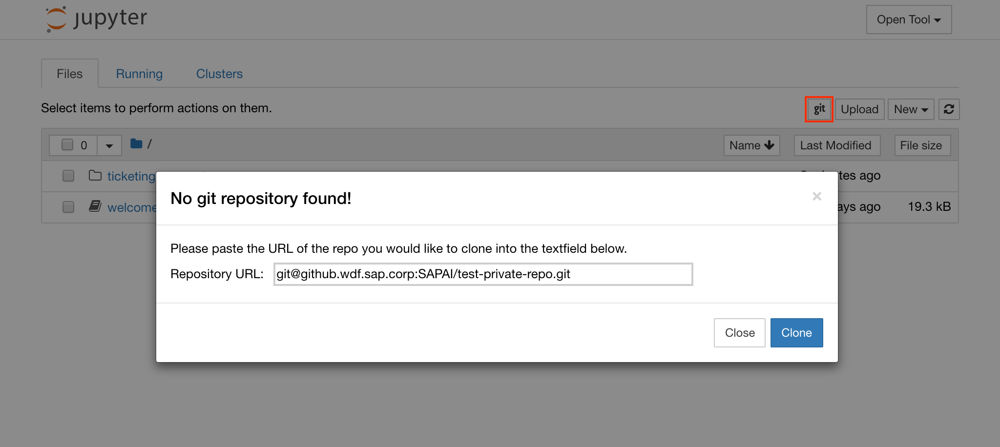](images/welcome-git-clone.png)

Once you have cloned the repository, it will appear at the selected location in your `/workspace` folder.

#### Push, Pull, Merge and Other Git Actions

To commit and push a single notebook to the remote Git repository, we recommend to use the Git plugin integrated into Jupyter as shown below:

[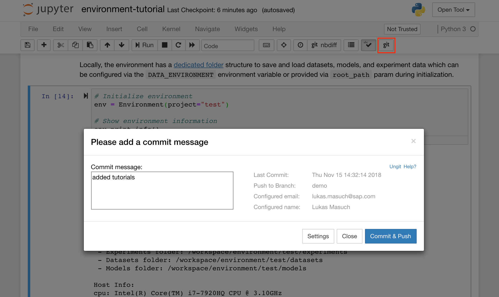](images/welcome-git-push.png)

The other tool for more advanced Git integrations is ungit. It offers a clean and intuitive web-based UI that makes it convenient to sync your code artifacts. With ungit, you can do most of the common git actions such as push, pull, merge, branch, tag, checkout, and many more.

[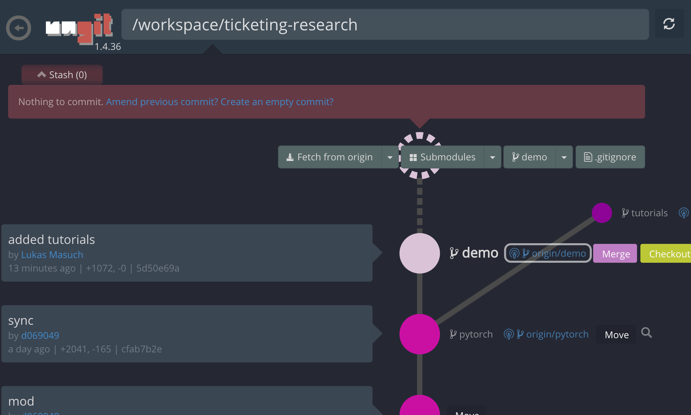](images/welcome-ungit-actions.png)

#### Solve Merge Conflicts

The workspace is pre-installed with [nbdime](https://github.com/jupyter/nbdime), a tool for diffing and merging of Jupyter notebooks. Nbdime understands the structure of notebook documents and, therefore, can make intelligent decisions when diffing and merging notebooks. In the case you have merge conflicts, nbdime will make sure that the notebook is still readable by Jupyter.

[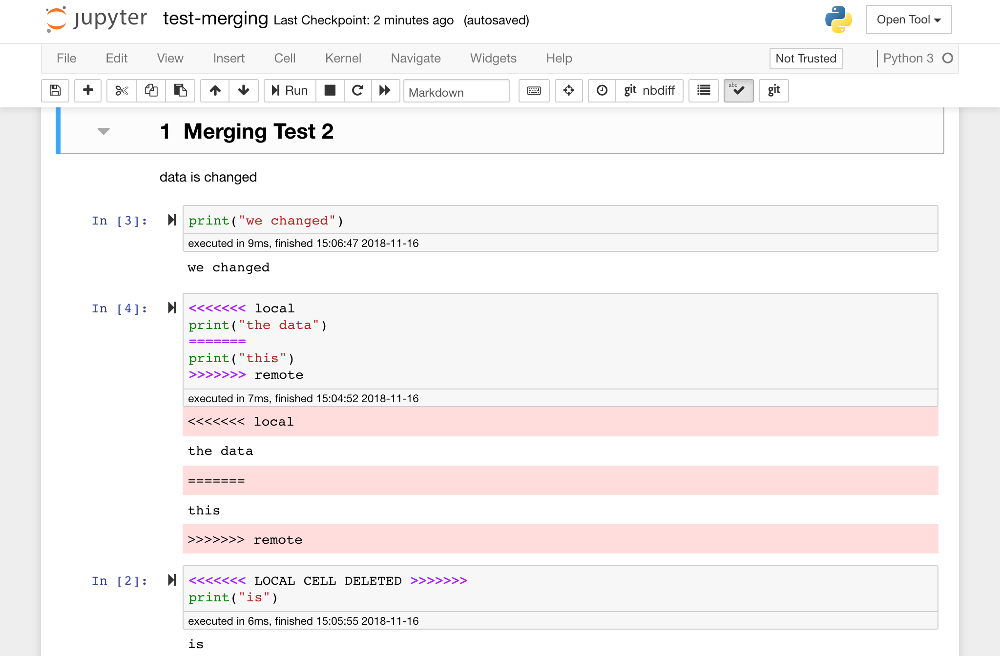](images/welcome-git-merging.png)

### Netdata

Netdata (`Open Tool -> Netdata`) is a real-time hardware and performance monitoring dashboard that visualise the processes and services on your Linux systems. It monitors metrics about CPU, GPU, memory, disks, networks, processes, and more. Use this tool during model training and other experimentation to get insights of everything happening on the system and figure out performance bottlenecks.

[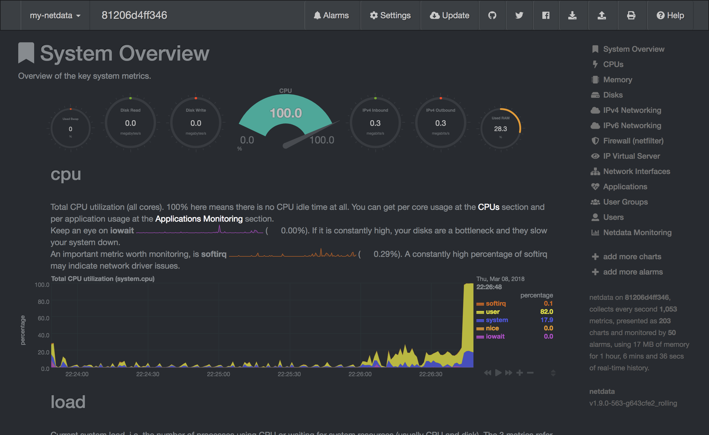](images/welcome-netdata.png)

!!! info
    Netdata will show you the hardware statistics of the server on which the workspace container is running.

### Glances

Glances (`Open Tool -> Glances`) is a web-based hardware and performance monitoring dashboard. It is an an alternative to Netdata.

[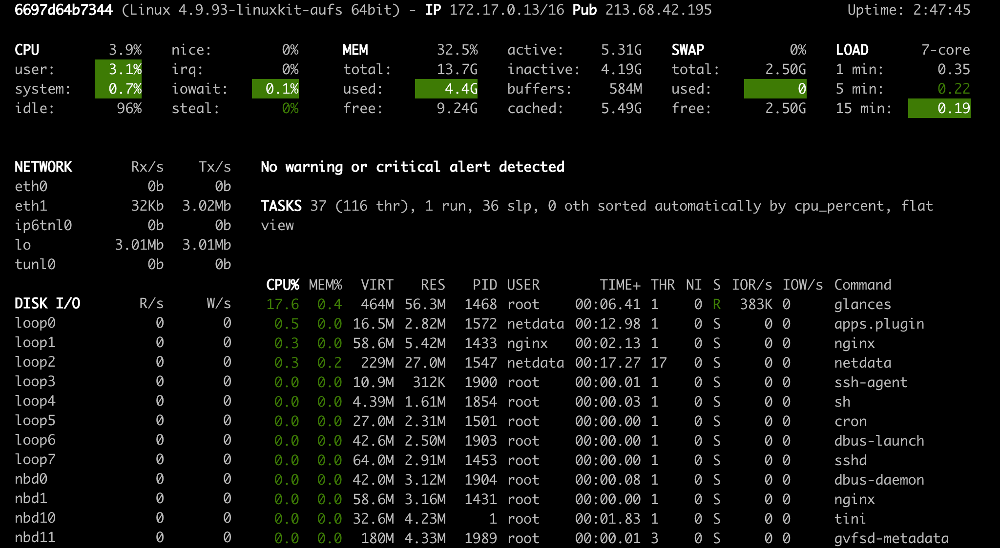](images/welcome-glances.png)

### JupyterLab

JupyterLab (`Open Tool -> JupyterLab`) is the next-generation user interface for Project Jupyter. It offers all the familiar building blocks of the classic Jupyter Notebook (notebook, terminal, text editor, file browser, rich outputs, etc.) in a flexible and powerful user interface. This JupyterLab instance comes pre-installed with a few helpful extensions such as a the [jupyterlab-toc](https://github.com/jupyterlab/jupyterlab-toc), [jupyterlab-git](https://github.com/jupyterlab/jupyterlab-git), and [juptyterlab-tensorboard](https://github.com/chaoleili/jupyterlab_tensorboard).

[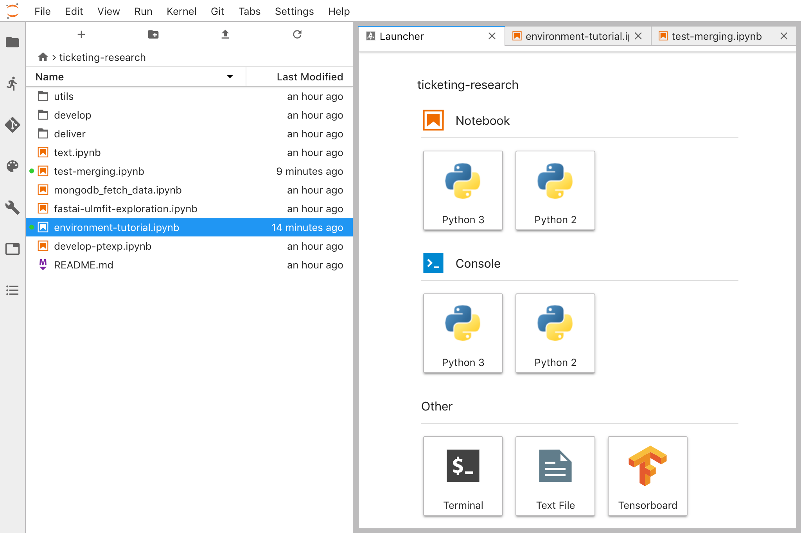](images/welcome-jupyterlab.png)

### Tensorboard

Tensorboard provides a suite of visualization tools to make it easier to understand, debug, and optimize you experiment runs. It includes logging features for scalar, histogram, model structure, embeddings, and text & image visualization. We have integrated Tensorboard into the Jupyter interface with functionalities to start, manage, and stop instances. You can open a new instance for a valid logs directory as shown below:

[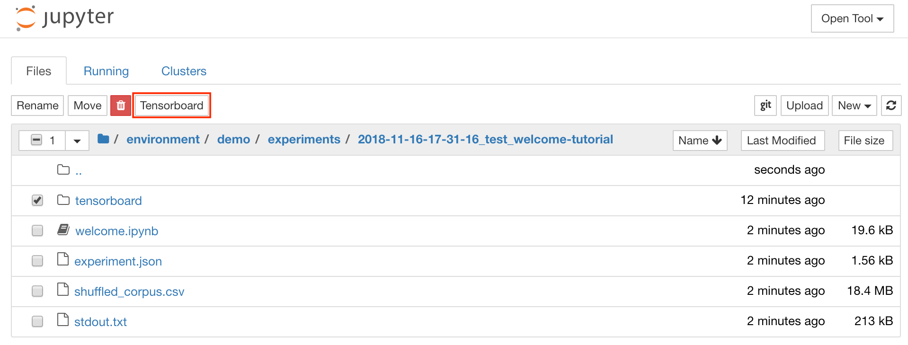](images/welcome-tensorboard-open.png)

If you have opened a Tensorboard instance in a valid log directory, you will see the visualizations of your logged data.

[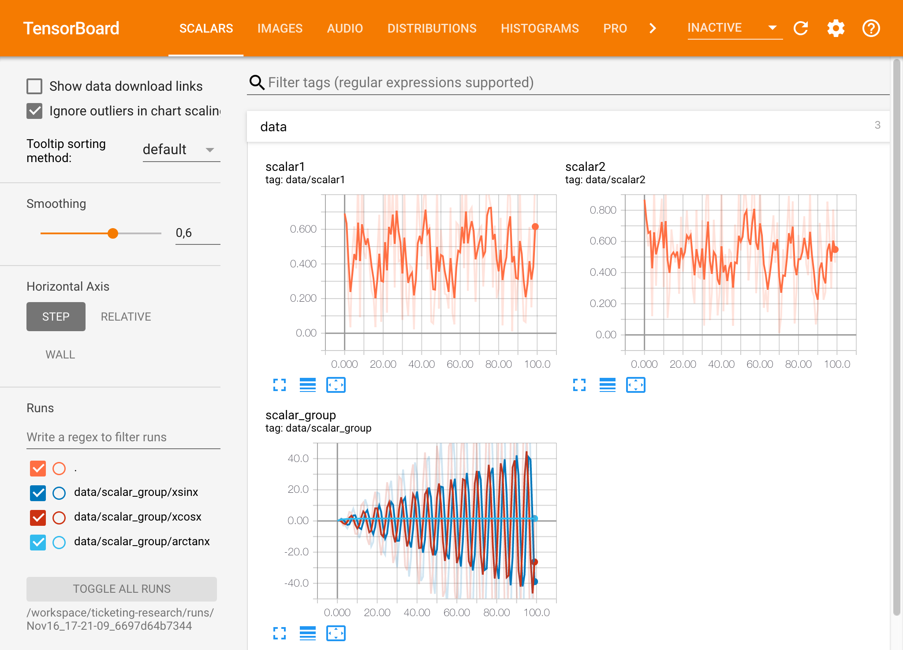](images/welcome-tensorboard-overview.png)

!!! tip "Experiment Tracking Integration"
    The experiment tracking from the ML Lab client library has tensorboard logging capabilities integrated for any machine learning framework (see the Environment Tutorial).
