# Walkthrough

In the following visual walkthrough, you will experience most of the features, interaction patterns, and tools that the ML Lab offers. You can either just scroll through everything to get a quick overview of how our platform is meant to be used, or you can use this walkthrough as a tutorial by replicating it step-by-step. Let's get started!

The first screen you will experience when visiting your ML Lab instance is this beautiful dashboard:

[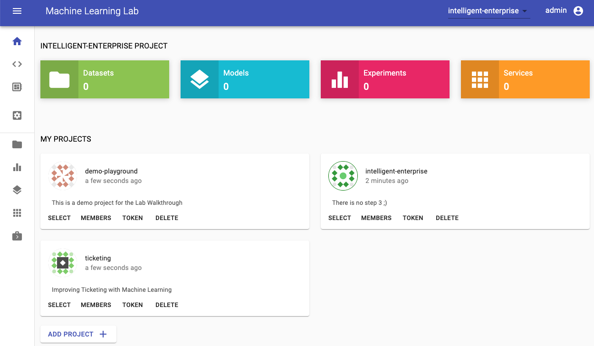](../images/lab-home.png)

This is your project's home section; it gives you an overview of the currently selected project and a section showing other available projects. If you are a new user, it will directly ask you to create your first project. We will get to this in the next section.

!!! note "Concept Definition: Project"
    A project is a digital space for tackling a specific data science use-case. It consists of multiple datasets, experiments, models, services, and jobs.

## Create Project

For this walkthrough, we will create a project which we will call `demo-project`. For your project you need to select a unique name that isn't already used by someone else on the ML Lab instance (e.g. `<username>-project`).

[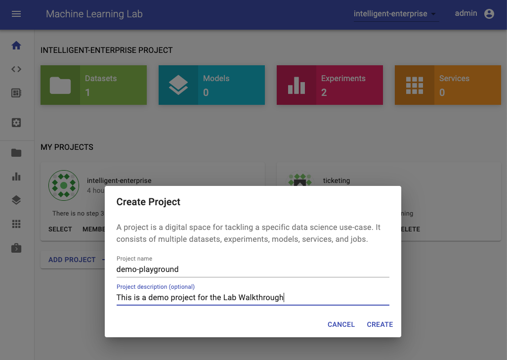](images/walkthrough-create-project.png)

After the creation, the project will be selected and appear on you home section. Since it is a new project, it does not have any datasets, models, services, and experiments yet.

[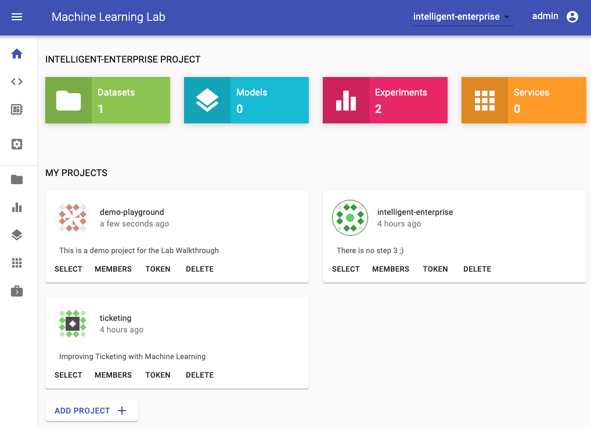](images/walkthrough-created-project.png)

## Upload Data

!!! note "Concept Definition: Dataset"
    A dataset is a single file that contains raw- or processed-data, usually preselected for a certain experiment. It is recommended to have the dataset in an easily readable format such as CSV for structured data or GraphML for graph data. If your dataset consists of multiple files (e.g. collection of images), we recommend zipping this dataset to a single file. Our python libraries have built-in support for his type of packaged data.

To start the experimentation process, we first need to upload a dataset. Therefore, we switch to the datasets section and select the upload functionality:

[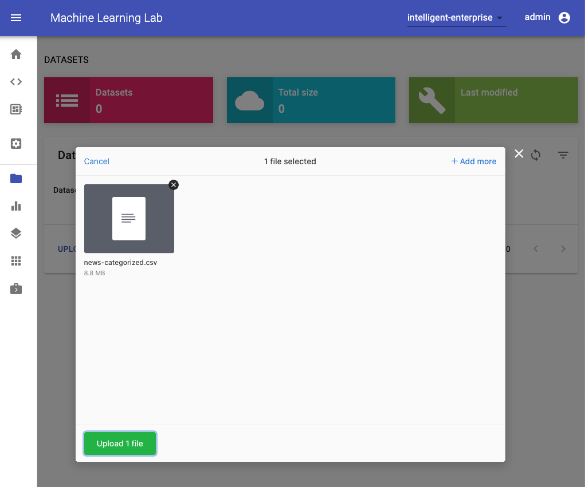](images/walkthrough-upload-dataset.png)

In this dialog, we can select and upload any file. For this walkthrough, we have prepared a dataset that contains a collection of news articles grouped into 20 categories ([20 Newsgroups](http://qwone.com/~jason/20Newsgroups/)). Our goal is to train a classification model that is able to predict the topic of a news article. You can download the dataset [here](data/download-dataset.html).

After we have uploaded the file, it will be shown as a dataset within the datasets table. Here we can see additional metadata and execute some actions, such as download, remove, and copy the datasets key to clipboard.

[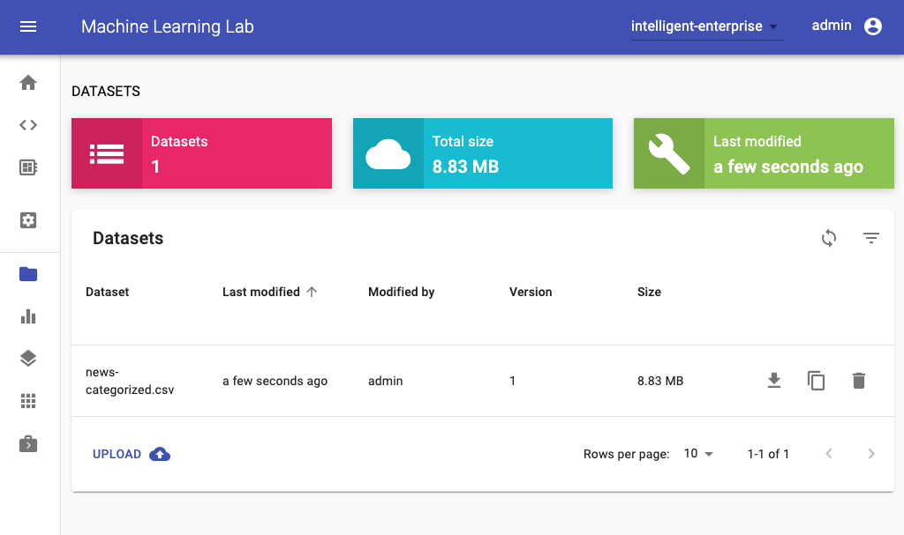](images/walkthrough-uploaded-dataset.png)

Finally, to get started with experiments on this dataset, please navigate to the workspace section.

## Access your Workspace

!!! note "Concept Definition: Workspace"
    A place for a data scientist to conduct a set of experiments centered on a given project or problem to solve. It can have many different notebooks and scripts containing different experiments that are carried out as the data scientist seek the best model. The workspace is implemented as an all-in-one web IDE specialized for machine learning and data science.

If you are a first-time user, the workspace will need a few seconds to setup and get ready. After it is setup, you will see the Jupyter Notebook Web UI. This workspace is an all-in-one web IDE specialized for machine learning and data science. It comes with Jupyter Notebook, a Desktop GUI, Git Integration, Tensorboard Integration, Hardware Monitoring, and many common ML libraries. It is also _project-independent_, therefore, you will use the same workspace for all of the projects.

The workspace is equipped with a selection of common tools to help with the data science and experimentation workflow. Many of these tools can be started from the _Open Tool_ menu. Within the workspace you can use our python client library to connect to ML Lab, as we will show below.

## Experimentation

!!! note "Concept Definition: Experiment"
    An experiment is a single execution of a data science code with specific parameters, data, and results. An experiment in the data science field usually refers to a single model training run, but can also be any other computational task, such as a data transformation, that requires a certain configuration and has some measurable results. All metadata and artifacts for an experiment such as parameters, timestamp, operator, data & model files, environment information, resulting metrics (e.g. accuracy), and other related information can easily be saved and shared with the experiment to enable reproducibility. During the experimentation process, one or more parameters are changed by the data scientist in an organized manner, and the effects of these changes on associated metrics are measured, recorded, and analyzed. Data scientist may try many different approaches, different parameters and fail many times before the required level of a metric is achieved.

To get started with our experimentation, please open the `text-classification.ipynb` notebook inside the `tutorials/` directory. Usually, we will have one notebook for every experiment. A notebook contains both computer code (e.g. python) and rich text elements (e.g. markdown).

[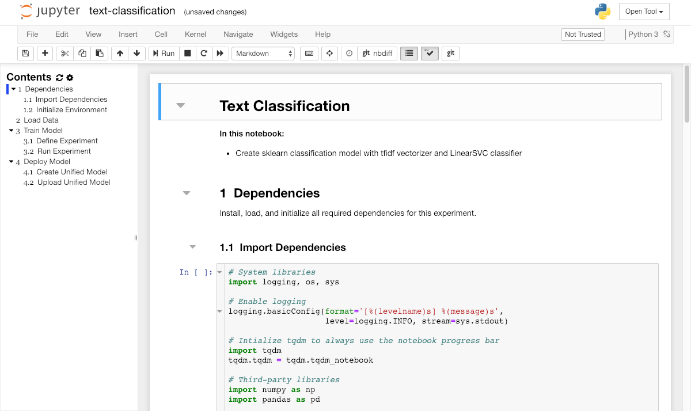](images/walkthrough-workspace-notebook.png)

This notebook will guide us through the process of training a classification model for our dataset via [sklearn](https://scikit-learn.org/).

!!! tip
    In the notebook, you can execute any code cell with this shortcut: <kbd>CTRL</kbd> + <kbd>Enter</kbd>

!!! note "Clone Repository"
    In this case, the notebook that contains the required code to train our classification model already exists in the workspace. However, sometimes you have to download code from external sources and especially if you collaborate with others, tools such as Git should be used to stay in sync. Luckily, Git is already installed within the workspace and can be accessed via the terminal. Conveniently, we also put a web-based UI called _Ungit_ into the workspace. You can open it from the _Open Tool_ menu. 

### Initialize Environment

Before we can get started with model training, we have to initialize the environment. The environment provides functionality to manage all project-related files (e.g. models & datasets) and experiments. The environment can be connected to an ML Lab instance by providing the ML Lab endpoint URL and a valid API token. If connected, the environment provides easy access to the ML Lab API and capabilities to download/upload data, and sync experiments. Locally, the environment has a dedicated folder structure to save and load datasets, models, and experiment data. Please insert the correct project-name for `LAB_PROJECT`.

[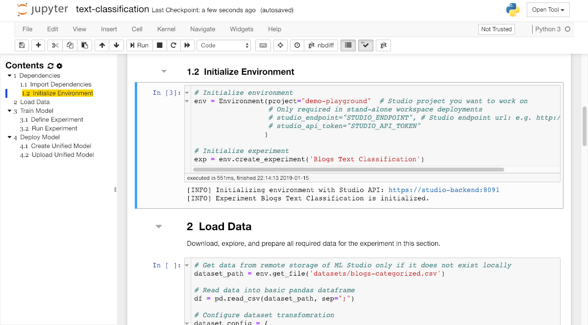](images/walkthrough-workspace-notebook-init-env.png)

Within this code section, we also initialize an experiment instance with the `create_experiment` method for our notebook. An experiment should be used to organize all metadata and resources such as parameters, timestamps, input & output files, resulting metrics (e.g. accuracy), and other related information for a single experiment run such as the model training within our demo notebook.

### Download Data

Once we have succesfully initialized the environment, we have full access to all the datasets, models, and services of the configured ML Lab project. A few minutes ago, we uploaded a dataset into our project. To access this dataset within or workspace, we need to get the unique file-key of the dataset. We can copy this key in the datasets page of our ML Lab instance by just clicking on the row of the choosen dataset.

[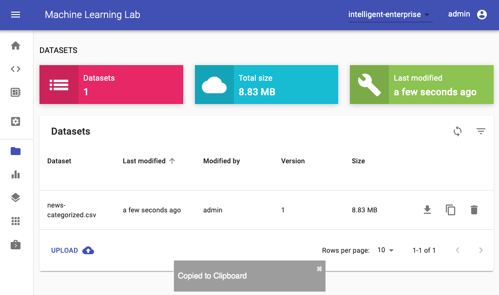](images/walkthrough-download-data.png)

Once we have the unique key for the dataset, we can use the `get_file` method in our experiment notebook to download the file into our workspace:

[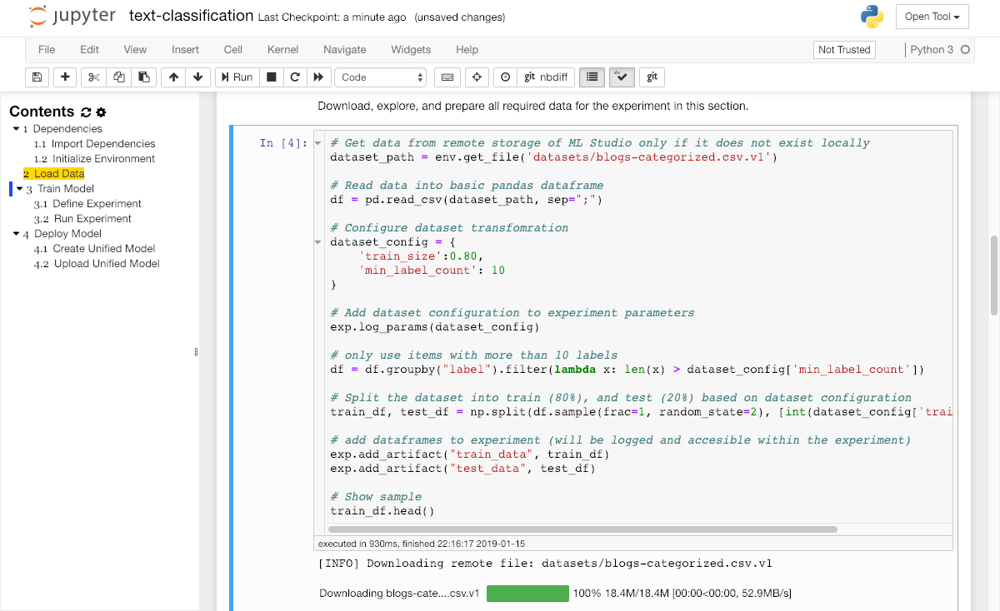](images/walkthrough-notebook-download-data.png)

Next, please run the explore and transform data sections to prepare the data for model training.

### Run Experiment

Finally, we arrived at the section where the magic happens. First we define our training algorithm and wrap it within a `train` function. Next, we need to define our hyperparameter configuration for this experiment run (in the `params` dict) and execute the `run_exp` function from the `Experiment` instance with the implemented `train` function and the `params` dictionary.

[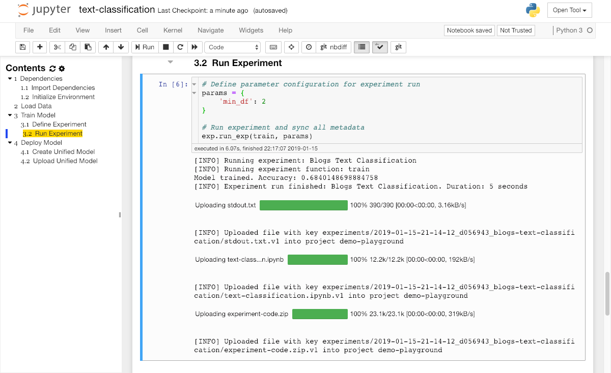](images/walkthrough-workspace-notebook-run-exp.png)

After the execution the training code, the experiment will require a short time for training. During this training, we offer some tools that helps us to monitor our experiment (accesible from the _Open Tools_ selection). For example, you can use netdata during model training and other experimentation to get insights of everything happening on the system (CPU, GPU, memory, disks...) and figure out performance bottlenecks.

[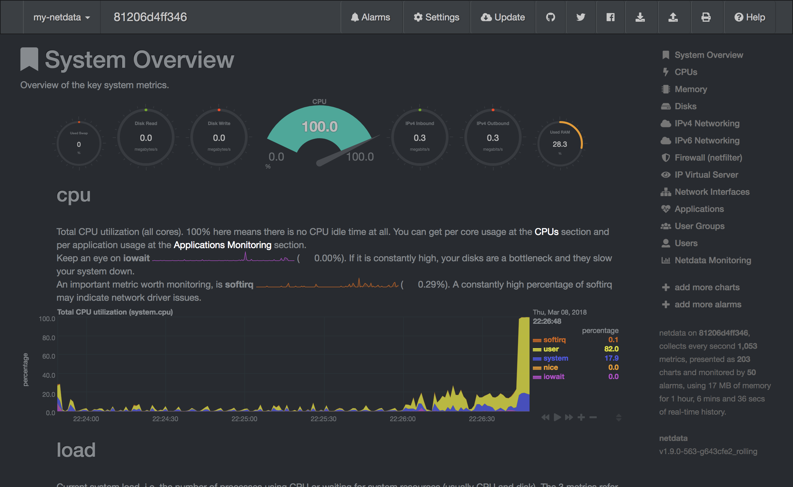](images/walkthrough-hardware-monitoring.png)

ML Lab also has integrated an experimentation dashboard for every project, that provides an overview for the team on all running and finished experiments with a lot of metadata to support reproducibility and transparency.

[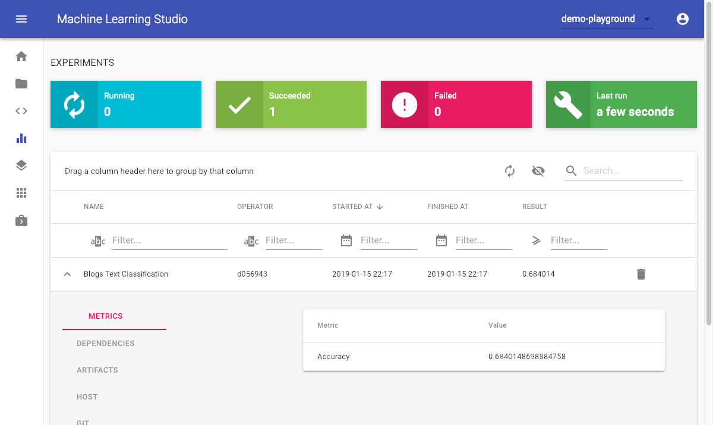](images/walkthrough-experiments.png)

### Create Unified Model

!!! note "Concept Definition: Model"
    A model is an artifact that is created in the training process. A model is something that predicts an output for a given input. Any file created after training from an ML algorithm is a model. The model needs to be deployed as a service in order to offer the model's prediction capabilities for integration into applications.

Once the training is finished, we will get a trained model instance as result which we can now use to predict an output for any given input. This model needs to be deployed as a service in order to offer the model's prediction capabilities for integration into applications. In order to easily share and deploy the trained model, we will use the unified model library to create a self-contained executable model file.

[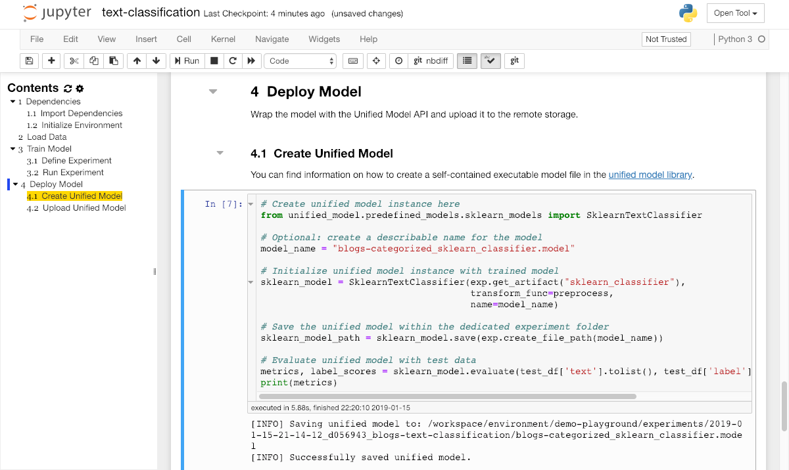](images/walkthrough-workspace-notebook-unified-model.png)

### Upload Model

After a final evaluation of the model accuracy, we want to make the trained model available for deployment so that it can be used from any application. Therefore, we need to upload the trained model artifact into the model storage of our ML Lab project from within the classification notebook via the `upload_file` method:

[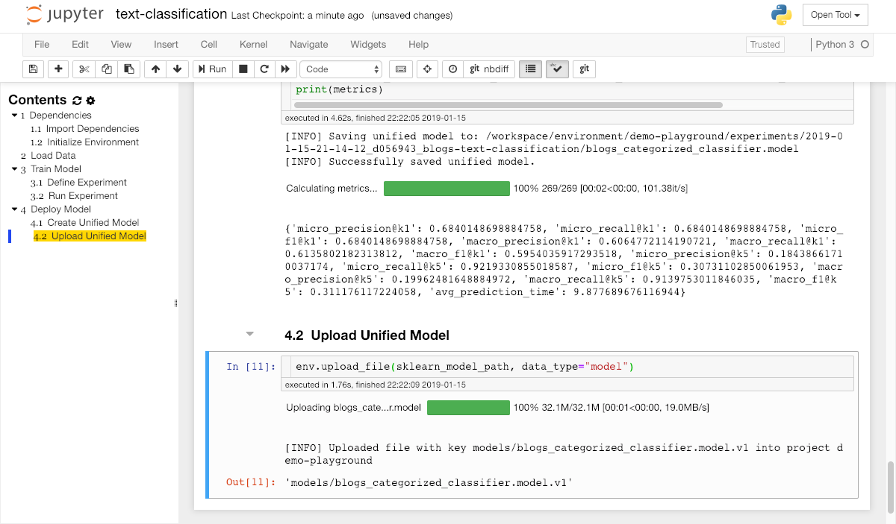](images/walkthrough-workspace-notebook-upload-model.png)

!!! info "Data Versioning"
    Our dataset and model store supports file versioning. This prevents you from overwriting any data or models.

Once we have successfully uploaded the model, we are finished with the notebook for this walktrough.

## Deploy Model

!!! note "Concept Definition: Service"
    A service is a software component that implements and provides specific capabilities. In our landscape, services are deployed as Docker containers and are usually accessible via a REST API over HTTP(S).

In order to deploy the uploaded model as a service into production, navigate to the *Services* page in the ML Lab. Click on the "Add Service" button and fill in the required fields. There are multiple possibilities how you provide the needed information. Either you create a Docker image that already contains the model or you create a generic image and provide information of how to download the model upon container start via an environment variable. For the latter one we recommend to use the ML Lab Python library in the image and just pass the model's name as an environment variable. ML Lab will inject other needed information such as project name, access token, and URL as environment variables automatically which are used by the Python library. One image that can be used for such a generic use-case is the *Unified Model*. You can copy the model's path in the *Models* section of the webapp.

[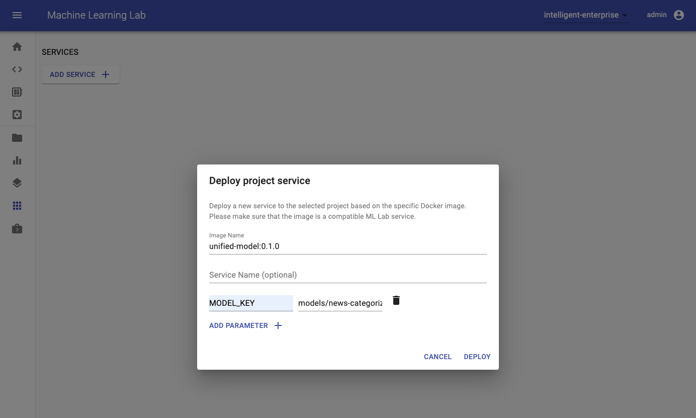](images/walkthrough-deploy-model2.png)

After a few seconds, the model service will appear on the services page of the ML Lab. 

[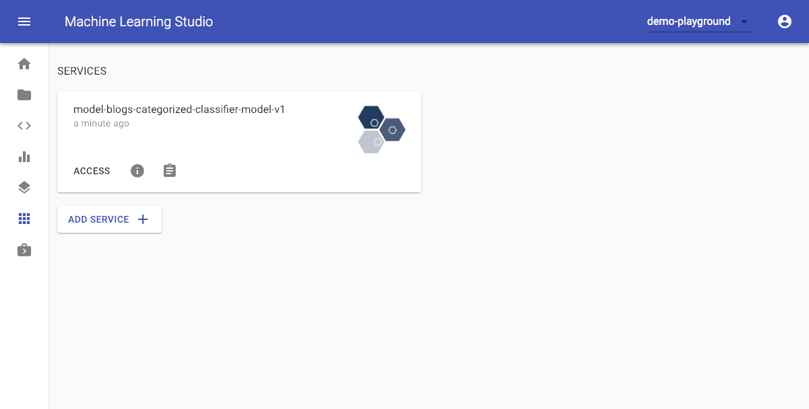](images/walkthrough-services.png)

If the deployed image follows the ML Lab service specification, you can access the REST API documentation by clicking the access button on the created model service and try the predict method with any kind of input data.

[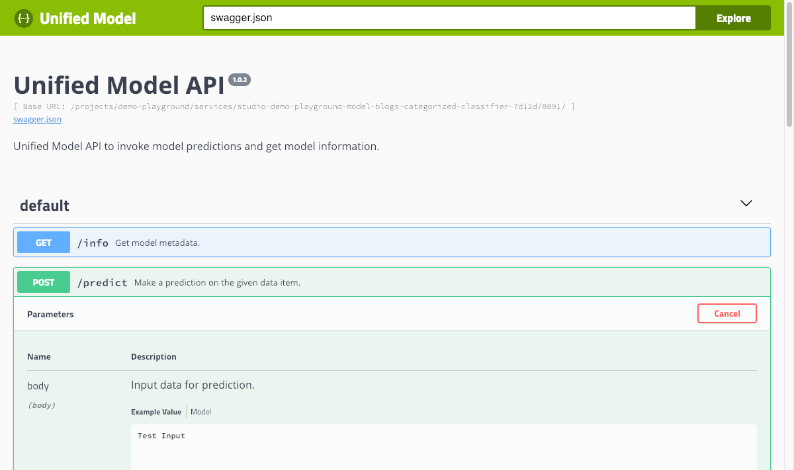](images/walkthrough-unified-model-api.png)

Congratulations :thumbsup: we have successfully trained a text classification model for the uploaded dataset and deployed it into production.

## Next Steps

- [Workspace](../../usage/lab-workspace): Explore your workspace.
- [Python Client](../../usage/lab-python-client): Learn more on how to use the python client libary.
